# Available Agents

All agent definitions live in `.github/agents/`. Each `.agent.md` file defines an agent's persona, tools, constraints, and quality standards. conductor.powder orchestrates 19 direct subagents and coordinates with 17 additional agents to ship production-quality code.

> **Maintenance**: When adding a new agent, use the `/new-agent` prompt. platform.agent-foundry creates the agent file, and platform.system-maintenance integrates it into the awareness chain automatically.

---

## How Agents Work

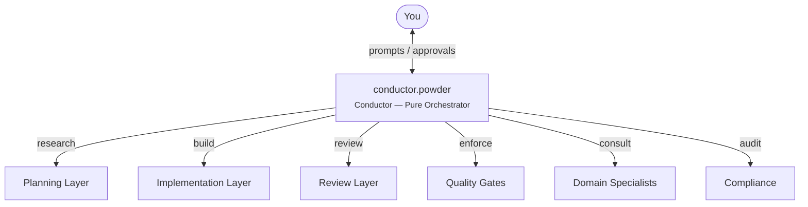

1. **You** interact with conductor.powder through prompts and approvals
2. **conductor.powder** never writes code — she delegates ALL work to specialized subagents
3. Each subagent executes autonomously, following its agent spec, injected skills, and instruction files
4. Results flow back to conductor.powder for orchestration decisions
5. Quality gates enforce mandatory standards before code can ship

---

## Agent Layers

Snow Patrol organizes its 36 agents into 8 layers based on their role in the development lifecycle.

### Layer Diagram

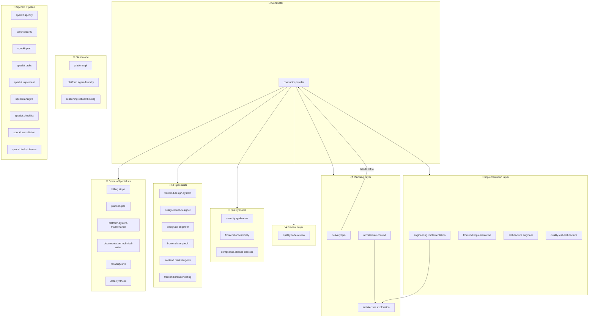

---

## Full Agent Roster

| Layer                  | Agent                            | Role                                                                                                                                        | Output                                                    |
| ---------------------- | -------------------------------- | ------------------------------------------------------------------------------------------------------------------------------------------- | --------------------------------------------------------- |
| **Conductor**          | `conductor.powder`               | Orchestrates all phases; delegates work; enforces gates; never writes code                                                                  | Plans, phase completions, commit messages                 |
| **Planning**           | `delivery.tpm`                   | Autonomous planner — orchestrates SpecKit pipeline and hands off to conductor.powder                                                        | Implementation plans                                      |
|                        | `architecture.context`           | Gathers context, researches requirements, returns structured findings                                                                       | Research reports                                          |
|                        | `architecture.exploration`       | Read-only codebase explorer — finds files, usages, dependencies                                                                             | File maps, dependency analysis                            |
| **Build**              | `engineering.implementation`     | Backend/core logic implementation following TDD                                                                                             | Code + tests                                              |
|                        | `frontend.implementation`        | Frontend UI/UX, styling, responsive layouts following TDD                                                                                   | Components + tests                                        |
|                        | `architecture.engineer`          | Architecture scaffolding (Firebase + React pnpm monorepo)                                                                                   | Project structure, config files                           |
|                        | `quality.test-architecture`      | Spec-driven test generation and coverage auditing                                                                                           | Test suites, coverage reports                             |
| **Review**             | `quality.code-review`            | Code review — verifies correctness, quality, test coverage                                                                                  | APPROVED / NEEDS_REVISION / FAILED                        |
| **Gates**              | `security.application`           | Security audit for Firebase apps (Auth, Firestore, Functions, Storage)                                                                      | PASS / FAIL with findings                                 |
|                        | `frontend.accessibility`         | Accessibility audit for WCAG 2.1/2.2 compliance                                                                                             | PASS / FAIL with findings                                 |
|                        | `compliance.phases-checker`      | Post-plan auditor verifying all phases executed with required gates                                                                         | PASS / FAIL / ESCALATED                                   |
| **UI Specialists**     | `frontend.design-system`         | Audits Figma + code component inventory; produces Reuse Plans; manages Figma artifacts, including generate-first live app capture workflows | Reuse Plan, Cross-Reference Map, Figma components + views |
|                        | `design.visual-designer`         | Decomposes design mocks into pixel-precise Visual Implementation Specs                                                                      | Visual Spec documents                                     |
|                        | `design.ux-engineer`             | Enforces CRUD completeness, UX/UI consistency, flow standards                                                                               | UX compliance plans                                       |
|                        | `frontend.storybook`             | Storybook setup, story writing, coverage auditing, MDX documentation                                                                        | Stories, coverage reports                                 |
|                        | `frontend.marketing-site`        | Marketing pages — landing, pricing, features, testimonials, CTAs                                                                            | Marketing page components                                 |
|                        | `frontend.browsertesting`        | Automated browser testing using VS Code integrated browser tools; also produces capture handoff evidence for live app to Figma work         | PASS / FAIL / BLOCKED with screenshots                    |
| **Domain Specialists** | `billing.stripe`                 | Stripe billing architecture — subscriptions, webhooks, entitlements                                                                         | Billing architecture plan, UX handoff                     |
|                        | `platform.pce`                   | Legal docs — Terms of Service, Privacy Policy, Cookie Policy                                                                                | Legal markdown documents                                  |
|                        | `platform.system-maintenance`    | Integrates new skills/instructions/prompts into the agent awareness chain                                                                   | PASS / FAIL integration report                            |
|                        | `documentation.technical-writer` | Technical documentation — READMEs, API docs, guides, changelogs, JSDoc                                                                      | Documentation files                                       |
|                        | `reliability.srre`               | Bug fix specialist — root cause analysis, surgical fixes, regression tests                                                                  | Bug fix reports                                           |
|                        | `data.synthetic`                 | Generates realistic synthetic data for demos, testing, Storybook, and dev environments                                                      | Factory functions, seed scripts, fixtures                 |
| **Standalone**         | `platform.git`                   | Git workflow — branches, commits, PRs, merges                                                                                               | Git operations                                            |
|                        | `platform.agent-foundry`         | Creates new custom agent files with optimal configurations                                                                                  | New `.agent.md` files                                     |
|                        | `reasoning.critical-thinking`    | Challenges assumptions, encourages rigorous analysis                                                                                        | Critical analysis                                         |
| **SpecKit**            | `speckit.specify`                | Creates feature specifications from natural language                                                                                        | `spec.md`                                                 |
|                        | `speckit.clarify`                | Asks targeted clarification questions and encodes answers into spec                                                                         | Updated `spec.md`                                         |
|                        | `speckit.plan`                   | Generates implementation plans from specs                                                                                                   | `plan.md`                                                 |
|                        | `speckit.tasks`                  | Generates dependency-ordered task lists                                                                                                     | `tasks.md`                                                |
|                        | `speckit.implement`              | Executes tasks defined in tasks.md                                                                                                          | Code changes                                              |
|                        | `speckit.analyze`                | Cross-artifact consistency analysis (spec, plan, tasks)                                                                                     | Analysis report                                           |
|                        | `speckit.checklist`              | Generates custom checklists from user requirements                                                                                          | Checklist                                                 |
|                        | `speckit.constitution`           | Creates/updates project constitution from principles                                                                                        | `constitution.md`                                         |
|                        | `speckit.taskstoissues`          | Converts tasks into GitHub issues with dependencies                                                                                         | GitHub issues                                             |

---

## Loop-Driven Execution Model (Ralph Loop)

### Why a Loop Model?

Traditional LLM agents operate in a single pass: receive a prompt, produce output, done. This works for simple tasks but fails for multi-phase development work because:

- **Phases depend on previous results** — you can't implement before planning, or review before implementing
- **Gates produce findings** — a failed accessibility audit requires remediation and re-audit, not just a note
- **Context degrades over time** — without explicit state tracking, the agent loses track of where it is in a long build cycle
- **Subagent results are unpredictable** — an implementation might succeed, partially succeed, or fail, and the conductor must adapt

The Ralph-inspired loop model solves this by giving conductor.powder an explicit **state machine** with iteration tracking. Instead of "do everything at once," Powder executes a series of controlled iterations, each advancing the task closer to completion — or explicitly declaring why it stopped.

### Loop States

Every task passes through these states in order. The conductor can only be in one state at a time:

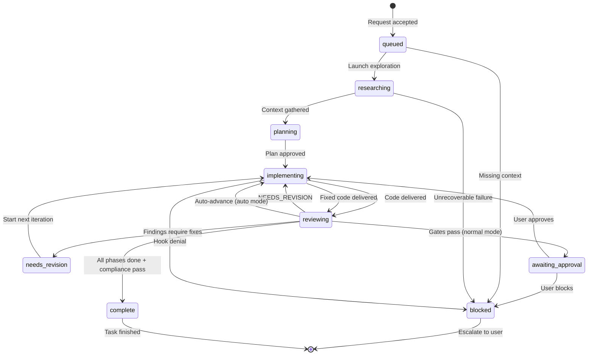

| State               | Meaning                                                            |
| ------------------- | ------------------------------------------------------------------ |
| `queued`            | Request accepted, no work launched yet                             |
| `researching`       | Exploration/research subagents gathering context                   |
| `planning`          | Plan or task decomposition being created or revised                |
| `implementing`      | One or more implementation subagents actively working              |
| `reviewing`         | Quality or gate subagents evaluating the latest iteration          |
| `needs-revision`    | Review findings require another implementation iteration           |
| `awaiting-approval` | Waiting for user decision (normal mode only)                       |
| `blocked`           | Hard stop — hook denial, missing context, or unrecoverable failure |
| `complete`          | Acceptance criteria satisfied, orchestration finished              |

### Iteration Tracking

Each loop through the states is an explicit **iteration**. Powder increments the iteration counter every time she re-enters the `implementing` state. This prevents infinite loops and provides audit visibility:

- **Iteration 1** — initial implementation
- **Iteration 2** — fix code review findings
- **Iteration 3** — fix accessibility FAIL
- **Iteration N** — if iterations exceed expectations, Powder can escalate

The current iteration number, state, and phase are persisted in `plans/powder-active-task-plan.md` — the rolling task capsule that survives across context boundaries.

### Launch-Set Protocol

Before every iteration, Powder builds a **launch set** — an explicit plan for what subagents will run and how:

| Category     | Meaning                                                       |
| ------------ | ------------------------------------------------------------- |
| `parallel`   | Independent work batched into one concurrent tool-call block  |
| `sequential` | Dependent work that must wait for prior results               |
| `deferred`   | Work intentionally postponed because prerequisites aren't met |

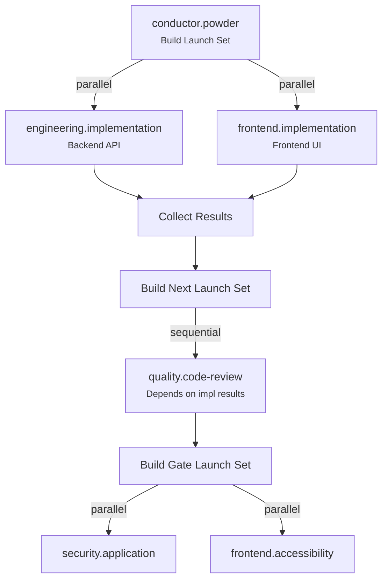

The launch set is recorded in the active-task plan before and after execution, so the next iteration can resume accurately without rediscovery.

### Termination Reasons

When the loop stops, Powder records an explicit termination reason — never silently halts:

| Reason                             | When                                   |
| ---------------------------------- | -------------------------------------- |
| `completed`                        | All acceptance criteria satisfied      |
| `awaiting-user`                    | Paused for user approval (normal mode) |
| `needs-revision`                   | Review findings require changes        |
| `blocked-by-hook`                  | A Copilot Hook denied a tool call      |
| `blocked-by-missing-context`       | Cannot proceed without information     |
| `blocked-by-unrecoverable-failure` | Subagent reported a fatal error        |
| `max-iterations`                   | Safety limit reached                   |

### Why This Matters

The loop model gives Snow Patrol three critical properties that single-pass agents lack:

1. **Resilience** — failures don't end the task. They trigger another iteration with targeted fixes, up to a safety limit.
2. **Auditability** — every iteration, state transition, and termination reason is recorded. You can always answer "what happened and why did it stop?"
3. **Parallelism** — the launch-set protocol forces Powder to think about independence before delegating, maximizing concurrent subagent execution instead of running everything sequentially.

---

## Orchestration Flows

### Full Development Lifecycle

conductor.powder runs a strict **Plan → Implement → Review → Commit** cycle for every phase:
F --> B
E --> G{"More Phases?"}
G -->|"Yes"| A
G -->|"No"| H["5 — COMPLIANCE AUDIT"]
H --> I{"Audit Pass?"}
I -->|"Yes"| J["DONE"]
I -->|"No"| K["Re-run Failed Gates"]
K --> H

````

### Planning Phase

conductor.powder delegates research to multiple subagents **in parallel**:

```mermaid
flowchart TD
    powder["conductor.powder"] -->|"parallel"| exp1["architecture.exploration<br/><small>Explore backend</small>"]
    powder -->|"parallel"| exp2["architecture.exploration<br/><small>Explore frontend</small>"]
    powder -->|"parallel"| exp3["architecture.exploration<br/><small>Explore tests</small>"]

    exp1 --> findings["Combined Findings"]
    exp2 --> findings
    exp3 --> findings

    findings --> ctx1["architecture.context<br/><small>Research subsystem A</small>"]
    findings -->|"parallel"| ctx2["architecture.context<br/><small>Research subsystem B</small>"]

    ctx1 --> plan["Draft Plan"]
    ctx2 --> plan

    plan --> approval{"User Approval<br/><small>(skipped in --auto)</small>"}
    approval -->|"Approved"| implement["Phase 2: Implement"]
````

### UI Implementation Phase (Per-Phase Agent Sequence)

Every UI phase follows this mandatory agent sequence. No agent may be skipped:

```mermaid
flowchart TD
    start["Phase Start"] --> dse_pre["1. frontend.design-system<br/><small>Reuse Plan — BEFORE implementation</small>"]

    dse_pre --> mock{"Design mock<br/>provided?"}
    mock -->|"Yes"| vd["2. design.visual-designer<br/><small>Visual Implementation Spec</small>"]
    mock -->|"No"| impl

    vd --> impl["3. frontend.implementation<br/><small>Build UI components</small>"]

    impl --> sb["4. frontend.storybook<br/><small>Stories for all new/modified components</small>"]

    sb --> dse_post["5. frontend.design-system<br/><small>Figma sync — create Figma components + views</small>"]

    dse_post --> cr["6. quality.code-review<br/><small>Code review</small>"]

    cr -->|"APPROVED"| a11y["7. frontend.accessibility<br/><small>Accessibility audit</small>"]
    cr -->|"NEEDS_REVISION"| impl

    a11y -->|"PASS"| sec{"Security<br/>relevant?"}
    a11y -->|"FAIL"| impl

    sec -->|"Yes"| secgate["8. security.application<br/><small>Security audit</small>"]
    sec -->|"No"| nav{"Nav-driven<br/>UI?"}

    secgate -->|"PASS"| nav
    secgate -->|"FAIL"| impl

    nav -->|"Yes"| bt["9. frontend.browsertesting<br/><small>Nav coverage test</small>"]
    nav -->|"No"| commit["Phase Complete"]

    bt -->|"PASS"| commit
    bt -->|"FAIL"| impl
```

### Backend Implementation Phase

Backend-only phases have a simpler agent sequence:

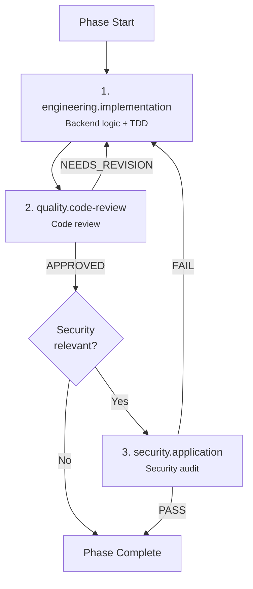

### Parallel Implementation

When a phase has both backend and frontend work on **separate files**, conductor.powder launches them simultaneously:

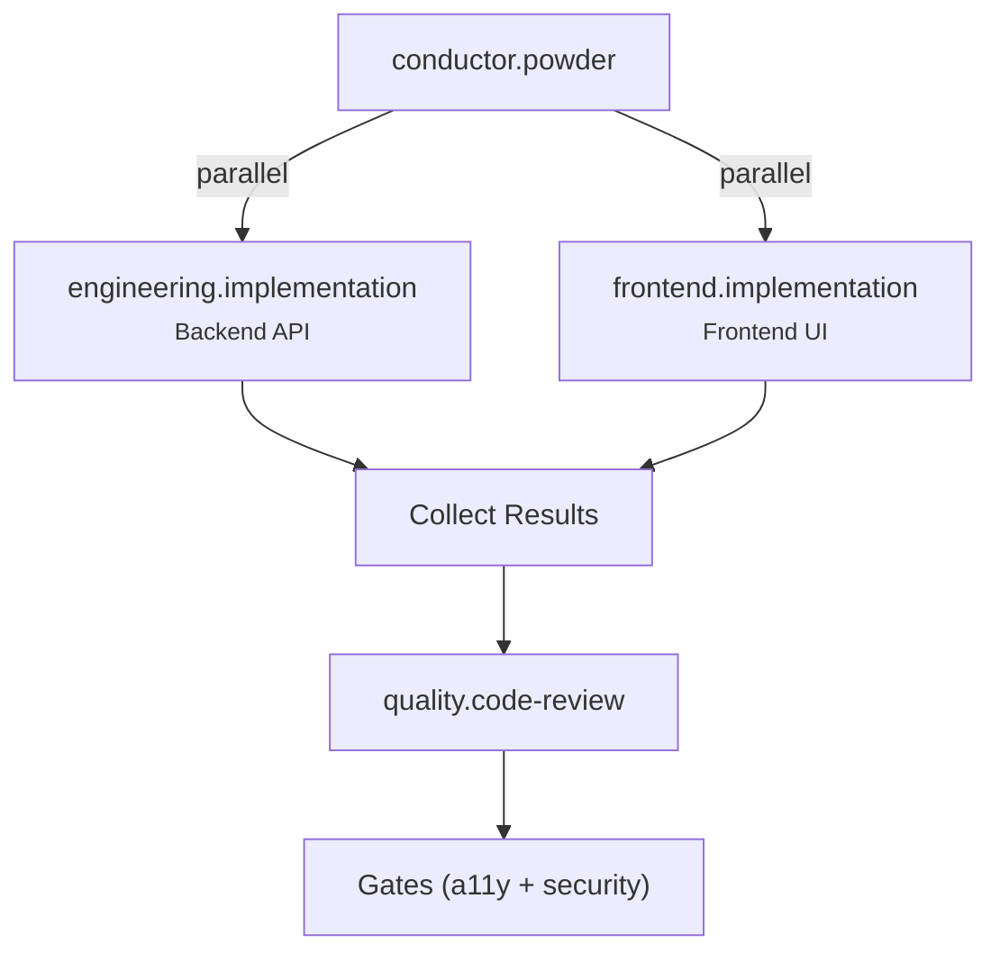

### Quick Fix Workflow (Bug Fixes)

For targeted bug fixes, conductor.powder uses a streamlined workflow that bypasses heavyweight planning:

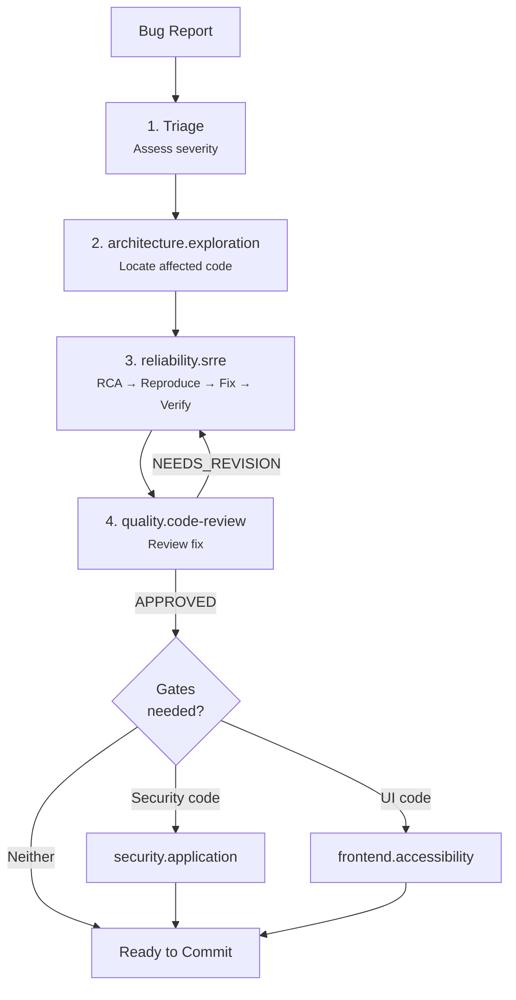

### Compliance Audit

After all implementation phases complete, compliance.phases-checker independently verifies every phase was properly executed:

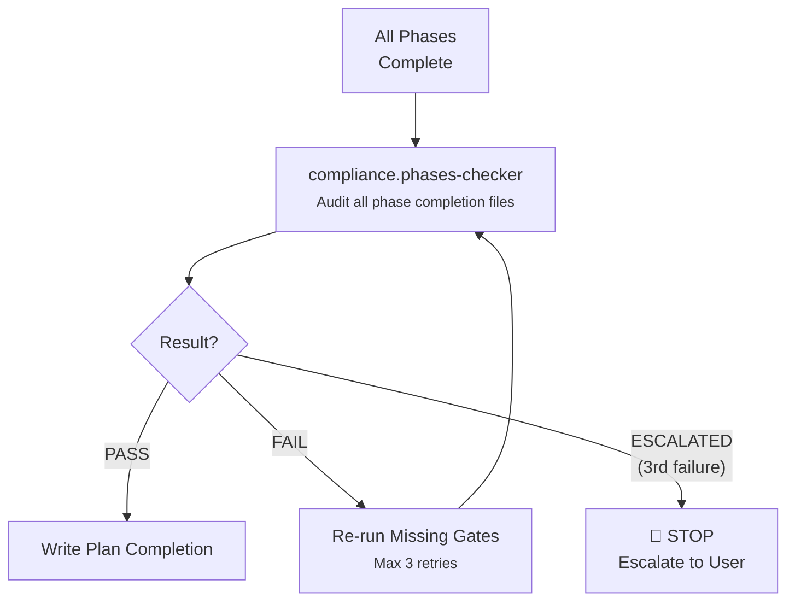

### SpecKit Pipeline

delivery.tpm orchestrates the specification-driven workflow and hands off to conductor.powder for implementation:

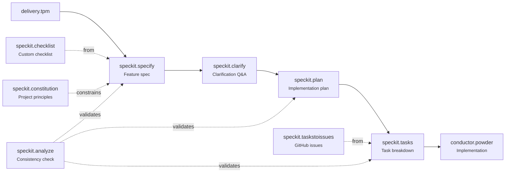

---

## Agent Relationship Map

This comprehensive graph shows which agents call which:

```mermaid
flowchart TD
    powder["conductor.powder<br/><small>Conductor</small>"]

    %% Planning
    powder --> ctx["architecture.context"]
    powder --> exp["architecture.exploration"]

    %% Build
    powder --> eng["engineering.implementation"]
    powder --> fe["frontend.implementation"]
    powder --> testarch["quality.test-architecture"]

    %% Review
    powder --> cr["quality.code-review"]

    %% Gates
    powder --> sec["security.application"]
    powder --> a11y["frontend.accessibility"]
    powder --> comp["compliance.phases-checker"]

    %% UI Specialists
    powder --> dse["frontend.design-system"]
    powder --> vd["design.visual-designer"]
    powder --> ux["design.ux-engineer"]
    powder --> sb["frontend.storybook"]
    powder --> mkt["frontend.marketing-site"]
    powder --> bt["frontend.browsertesting"]

    %% Domain Specialists
    powder --> stripe["billing.stripe"]
    powder --> pce["platform.pce"]
    powder --> sys["platform.system-maintenance"]
    powder --> docs["documentation.technical-writer"]
    powder --> srre["reliability.srre"]
    powder --> synth["data.synthetic"]

    %% Inter-agent relationships
    tpm["delivery.tpm"] -->|"hands off"| powder

    ctx --> exp
    eng --> exp
    fe --> a11y
    cr --> a11y

    %% SpecKit chain
    tpm --> specify["speckit.specify"]
    tpm --> clarify["speckit.clarify"]
    tpm --> plan["speckit.plan"]
    tpm --> tasks["speckit.tasks"]
```

---

## Gate Enforcement Chain

Quality gates form a mandatory checkpoint chain. No code ships without passing all applicable gates:

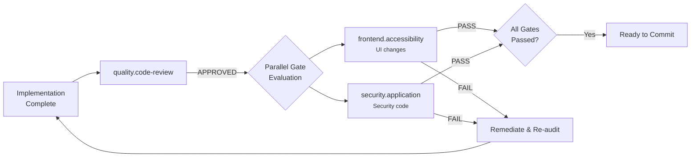

**Gate triggers — which gate runs when:**

| Gate                        | Triggers When Phase Touches                                                                            |
| --------------------------- | ------------------------------------------------------------------------------------------------------ |
| `quality.code-review`       | **Always** — every implementation phase                                                                |
| `frontend.accessibility`    | UI components, forms, navigation, modals, interactive widgets, theming, color/contrast                 |
| `security.application`      | Firestore rules, Cloud Functions, auth flows, multi-tenant scoping, storage rules, high-cost endpoints |
| `compliance.phases-checker` | **Once** — after all phases complete, before plan completion                                           |
| `frontend.browsertesting`   | App shells, primary navigation, dashboard suites, multi-destination nav                                |

---

## Agent Details

### Conductor

#### conductor.powder

**Role:** Pure orchestrator — delegates ALL work to specialized subagents. Never writes code, never reads source files directly.

**Manages:**

- Full development lifecycle: Plan → Implement → Review → Commit
- Loop-driven execution with explicit states: `queued`, `researching`, `planning`, `implementing`, `reviewing`, `needs-revision`, `awaiting-approval`, `blocked`, `complete`
- Gate enforcement and remediation loops
- Parallel subagent launches for independent tasks
- SpecKit artifact discovery and constitution enforcement

**Execution modes:**

- `normal` — pauses for user approval between phases
- `--auto` — continues without pausing, but still runs ALL gates

**State files:**

- `plans/powder-active-task-plan.md` — rolling task capsule
- `agents/agent-registry.json` — agent health and status tracking

---

### Planning Layer

#### delivery.tpm

**Role:** Autonomous planner that orchestrates the SpecKit pipeline (specify → clarify → plan → tasks) and hands off to conductor.powder for implementation.

**Called by:** User (directly)
**Hands off to:** conductor.powder

#### architecture.context

**Role:** Gathers context and researches requirements. Returns structured findings to the parent agent. Does not write plans — only researches.

**Called by:** conductor.powder
**Uses:** architecture.exploration for codebase scanning

#### architecture.exploration

**Role:** Read-only codebase explorer. Finds files, usages, dependencies, and context. Never edits files, never runs commands beyond file system reads.

**Called by:** conductor.powder, architecture.context, engineering.implementation
**Output format:** `<analysis>` → tool usage → `<results>` with `<files>`, `<answer>`, `<next_steps>`

---

### Implementation Layer

#### engineering.implementation

**Role:** Backend/core logic implementation following strict TDD: write failing tests → minimal code → tests pass → lint/format.

**Called by:** conductor.powder
**Uses:** architecture.exploration for codebase exploration

#### frontend.implementation

**Role:** Frontend UI/UX specialist. Implements user interfaces, styling, and responsive layouts following TDD.

**Called by:** conductor.powder
**Receives:** frontend.design-system Reuse Plan, design.visual-designer Visual Spec (when available)
**Uses:** frontend.accessibility for mid-implementation a11y verification

#### architecture.engineer

**Role:** Architecture scaffolding specialist. Sets up pnpm monorepos with React 18, TypeScript, Vite, Tailwind, shadcn/ui, Zustand, React Query, Firebase (Auth, Firestore, Functions, Hosting), react-hook-form + zod.

**Called by:** conductor.powder

#### quality.test-architecture

**Role:** Test engineering — two modes:

- **Test-First:** Reads specs → generates failing test suites before implementation
- **Coverage Audit:** Reads code + specs → finds untested paths → writes missing tests

**Called by:** conductor.powder
**Pairs with:** engineering.implementation (TDD pair), frontend.implementation (component test pair)

---

#### data.synthetic

**Role:** Synthetic data generation specialist. Creates typed factory functions, seed scripts, Storybook fixtures, and test data using Faker.js with deterministic seeding. Discovers schemas, designs generation strategies, builds relationship-aware data graphs, and exports fixtures for dev/demo/staging/load-test profiles.

**Called by:** conductor.powder
**Uses:** synthetic-data skill
**Output:** Factory files, seed scripts, fixture exports, data generation README, completion report
**Parallel:** Can run alongside engineering.implementation and frontend.implementation when data generation is independent

---

### Review Layer

#### quality.code-review

**Role:** Reviews implementation for correctness, code quality, and test coverage.

**Called by:** conductor.powder (after every implementation phase)
**Output:** APPROVED / NEEDS_REVISION / FAILED
**Uses:** frontend.accessibility for a11y-specific review delegation

---

### Quality Gates

#### security.application

**Role:** Security audit for Firebase apps. Covers Auth, Firestore rules, Cloud Functions, Storage, multi-tenant scoping, and high-cost endpoints.

**Called by:** conductor.powder (mandatory for security-relevant phases)
**Output:** PASS / FAIL with findings categorized as CRITICAL / HIGH / MEDIUM / LOW
**Blocking:** FAIL with CRITICAL or HIGH findings stops the commit path

#### frontend.accessibility

**Role:** WCAG 2.1/2.2 accessibility audit. Covers semantic HTML, keyboard navigation, ARIA patterns, contrast, focus management, and assistive tech compatibility.

**Called by:** conductor.powder, frontend.implementation, quality.code-review, design.ux-engineer
**Output:** PASS / FAIL with WCAG success criteria references
**Blocking:** FAIL with CRITICAL or HIGH findings stops the commit path

#### compliance.phases-checker

**Role:** Post-plan auditor that independently verifies all phases were properly executed with their required gates. Breaks the self-certification loop where conductor.powder writes her own Phase Gate Receipts.

**Called by:** conductor.powder (once, after all implementation phases complete)
**Output:** PASS / FAIL / ESCALATED
**Retry policy:** Maximum 3 attempts. Escalates to user after 3rd failure.
**Checks:** Phase Gate Receipts, evidence cross-referencing against workspace artifacts, gate batching anti-patterns

---

### UI Specialists

#### frontend.design-system

**Role:** Audits both Figma (via official Figma MCP) and codebase component libraries. Produces Reuse Plans mapping features to existing components. Creates and syncs Figma components plus assembled user-facing view frames after implementation. When the source of truth is a running localhost or live web app, it requires browser-verified route/state evidence and uses `generate_figma_design` as the first capture step.

**Called by:** conductor.powder (BEFORE and AFTER every UI implementation)
**Output (pre-implementation):** Reuse Plan, Component Inventory, Cross-Reference Map, Storybook Handoff Package
**Output (post-implementation):** Figma components and view frames managed via official Figma MCP; for live capture work, the output follows browser evidence -> `generate_figma_design` -> `use_figma` refinement
**Tools:** Official Figma MCP (`get_design_context`, `get_screenshot`, `get_metadata`, `get_variable_defs`, `get_code_connect_map`, `add_code_connect_map`, `create_design_system_rules`, `generate_figma_design`, `use_figma`, `search_design_system`, `create_new_file`)

#### design.visual-designer

**Role:** Visual Design Authority. Decomposes design mocks into pixel-precise Visual Implementation Specs that frontend.implementation follows for faithful implementation. For running-app-to-Figma requests, this is fallback-only and not the default replacement for live capture.

**Called by:** conductor.powder (for mock-driven UI work)
**Receives:** frontend.design-system Reuse Plan, design mock / Figma frame / Powder's v2 Visual Description
**Output:** Visual Spec with Layout Structure, Component Map, Token Map, Typography Spec, Spacing Spec, Interactive States
**Tools:** Official Figma MCP (`get_design_context`, `get_screenshot`, `get_metadata`, `get_variable_defs`, `generate_figma_design`, `use_figma`, `search_design_system`, `create_new_file`, `whoami`)
**QA mode:** Can re-verify implementation against original mock, returning PASS / FAIL with deviation categories

#### design.ux-engineer

**Role:** Enterprise UX + Engineering agent. Enforces CRUD completeness, UX/UI consistency, cohesive theming, wizard/form standards, and Checklist.design Flow best practices.

**Called by:** conductor.powder (for feature work requiring flow compliance)
**Receives:** frontend.design-system Reuse Plan

#### frontend.storybook

**Role:** Storybook specialist for component documentation. Handles setup, story writing (`.stories.tsx`), MDX docs, coverage auditing, and config maintenance.

**Called by:** conductor.powder (MANDATORY after every UI implementation phase)
**Receives:** frontend.design-system Reuse Plan, Cross-Reference Map, Storybook Handoff Package
**Output:** Story files, coverage reports, build status

#### frontend.marketing-site

**Role:** Marketing page specialist for public-facing pages. Implements hero sections, feature grids, pricing tiers, testimonials, FAQ, CTAs, social proof.

**Called by:** conductor.powder
**Domain:** Marketing/pre-auth pages only — not app-internal UI (that's frontend.implementation)

#### frontend.browsertesting

**Role:** Automated browser testing using VS Code's integrated browser tools. Navigates pages, interacts with elements, takes screenshots, verifies forms, responsive layouts, auth flows, and accessibility. For running-app-to-Figma work, it is also the evidence collection phase.

**Called by:** conductor.powder (mandatory for nav-driven/app-shell UI and for running-app-to-Figma capture workflows)
**Prerequisites:** Dev server running, VS Code browser tools enabled
**Output:** PASS / FAIL / BLOCKED with screenshots, findings, and when applicable a Capture Handoff Package with canonical route/state inventory, reachable/non-placeholder confirmation, and capture order for `generate_figma_design`

---

### Domain Specialists

#### billing.stripe

**Role:** Stripe billing architecture — subscriptions, trials, checkout, webhooks, entitlements. Designs backend architecture and produces UX handoff specs (does NOT build UI).

**Called by:** conductor.powder
**Output:** Stripe objects plan, Firestore billing model, Cloud Functions API, webhook event map, entitlements model, UX handoff requirements
**Cross-agent:** Requires security.application review of billing Functions + platform.pce for TOS/Privacy Policy billing clauses + frontend.implementation for UI

#### platform.pce

**Role:** Legal docs sub-agent. Drafts and maintains Terms of Service, Privacy Policy, and Cookie Policy. Not a lawyer — escalates high-risk items for counsel review.

**Called by:** conductor.powder
**Triggers:** Production launch, new data collection, AI features, new subprocessors, auth changes, regional expansion, payment changes
**Output:** Legal markdown documents, compliance/risk checklist, assumptions list

#### platform.system-maintenance

**Role:** System maintainer. Integrates new skills, instructions, and prompts into the agent awareness chain. Updates agent config files, validates wiring consistency.

**Called by:** conductor.powder
**Edits:** `.agent.md` files, `copilot.instructions.md`, `agent-registry.json`
**Output:** PASS / FAIL / NEEDS_REVIEW integration report

#### documentation.technical-writer

**Role:** Technical documentation specialist. Reads code to produce accurate READMEs, API docs, architecture docs, guides, changelogs, and inline JSDoc/TSDoc.

**Called by:** conductor.powder (also mandatory documentation gate when phases modify system artifacts)
**Uses:** architecture.exploration for code reading

#### reliability.srre

**Role:** Senior engineer bug-fix specialist. Used by the Quick Fix workflow for targeted bug resolution without heavyweight planning.

**Called by:** conductor.powder (Quick Fix workflow only)
**Process:** RCA → Reproduce → Fix → Verify
**Constraint:** Does not refactor or expand scope. If the bug requires architectural changes, stops and reports back for full planning.

---

### Standalone Agents

These agents operate independently and are not directly orchestrated by conductor.powder's standard lifecycle:

#### platform.git

**Role:** Git workflow agent. Creates branches, commits changes, opens PRs with detailed descriptions, and merges into mainline.

**Invoked by:** User or conductor.powder for git operations

#### platform.agent-foundry

**Role:** Creates new custom agent files with optimal configurations, persona definitions, and tool permissions.

**Invoked by:** User or platform.system-maintenance

#### reasoning.critical-thinking

**Role:** Challenges assumptions and encourages rigorous analysis. Helps evaluate tradeoffs and prevent premature commitments.

**Invoked by:** User or any agent needing critical analysis

---

### SpecKit Pipeline Agents

These 9 agents implement the specification-driven development workflow, typically orchestrated by delivery.tpm:

| Agent                   | Step | Input                                | Output                                           |
| ----------------------- | ---- | ------------------------------------ | ------------------------------------------------ |
| `speckit.specify`       | 1    | Natural language feature description | `spec.md` with user stories, acceptance criteria |
| `speckit.clarify`       | 2    | `spec.md` with underspecified areas  | Updated `spec.md` with clarification answers     |
| `speckit.plan`          | 3    | `spec.md`                            | `plan.md` with implementation phases             |
| `speckit.tasks`         | 4    | `spec.md` + `plan.md`                | `tasks.md` with dependency-ordered tasks         |
| `speckit.implement`     | 5    | `tasks.md`                           | Code changes following the task list             |
| `speckit.analyze`       | —    | `spec.md` + `plan.md` + `tasks.md`   | Consistency and quality analysis                 |
| `speckit.checklist`     | —    | User requirements                    | Custom feature checklist                         |
| `speckit.constitution`  | —    | Principle inputs                     | `constitution.md` (project-wide constraints)     |
| `speckit.taskstoissues` | —    | `tasks.md`                           | GitHub issues with dependencies                  |

---

## Skill Injection

conductor.powder automatically injects domain-specific skills into subagent prompts. Each skill's `agents:` frontmatter field declares which agents should receive it.

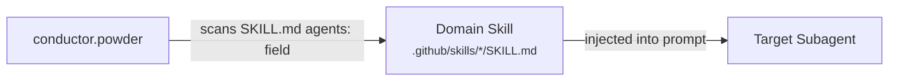

Skills are injected at delegation time — the subagent reads the skill file and applies its knowledge to the current task. See [Available Skills](available-skills.md) for the full skill catalog.

---

## Instruction Injection

conductor.powder injects coding instruction files based on the file types the subagent will touch. Each instruction's `applyTo` glob pattern determines which files it applies to.

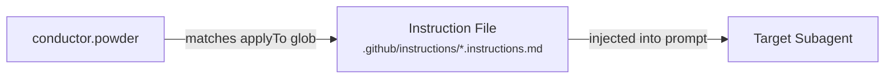

For example, a subagent editing `.ts` files receives `typescript-5-es2022.instructions.md`, `reactjs.instructions.md`, and other matching instructions. See [Available Instructions](available-instructions.md) for the full catalog.

---

## Execution Modes

| Mode       | Flag      | Behavior                                                                           |
| ---------- | --------- | ---------------------------------------------------------------------------------- |
| **Normal** | (default) | Pauses for user approval between phases. Full control over each step.              |
| **Auto**   | `--auto`  | Continues without pausing. Still runs ALL gates — auto means faster, not sloppier. |

In both modes, every mandatory gate (code review, accessibility, security, Storybook, Figma sync, browser testing, compliance audit) executes identically. Auto mode only skips the human approval pause between phases.

---

## Agent Health Monitoring

conductor.powder maintains an agent registry at `agents/agent-registry.json` that tracks:

- Agent name, file path, role, status (enabled/disabled)
- Last run timestamp, last caller, last run summary
- Last review status (APPROVED/NEEDS_REVISION/FAILED/PASS/FAIL)
- Health score (0–100) with grade (A–F)

Use `/list-agents` in conductor.powder to view the full health report, or `/agent-graph` to see a Mermaid dependency graph.

---

## Related Documentation

- [Available Skills](available-skills.md) — Domain knowledge packages injected into agents
- [Available Instructions](available-instructions.md) — Coding standards applied by file type
- [Available Hooks](available-hooks.md) — Deterministic enforcement via shell scripts
- [Available Prompts](available-prompts.md) — Slash-command prompt templates
- [Available MCPs](available-mcps.md) — Model Context Protocol server integrations
- [How To: Setup New Project](how-to-setup-new-project.md) — Full 11-step setup workflow
- [How To: Update Agents](how-to-update-agents.md) — Agent modification and maintenance
