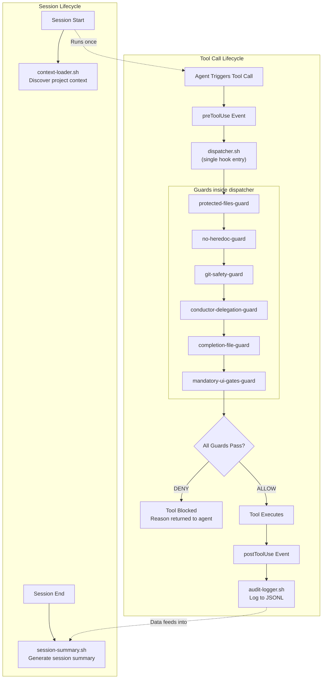
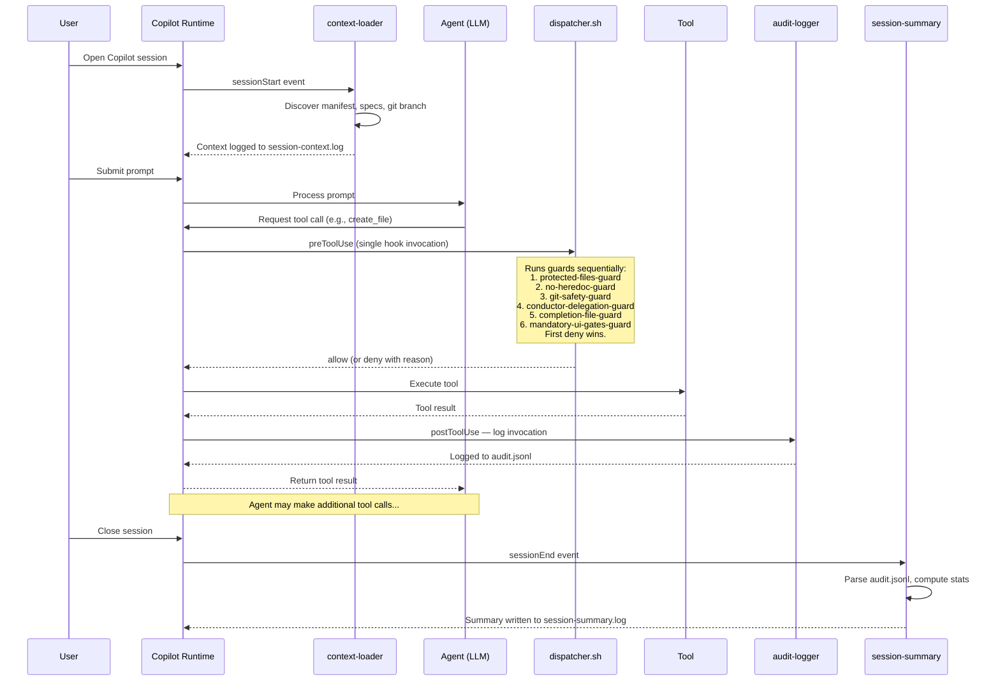
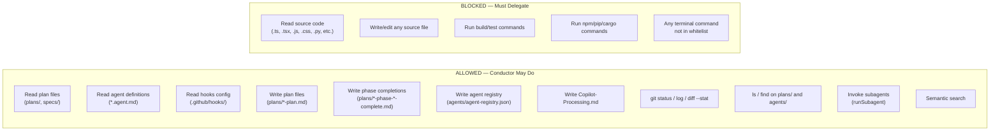

# Available Hooks

Copilot Hooks provide **deterministic enforcement** of framework safety rules, git conventions, and delegation constraints. Unlike instruction files (which rely on the LLM choosing to follow them), hooks are shell scripts that run automatically before or after every tool call — they cannot be bypassed, ignored, or forgotten.

Snow Patrol uses a two-layer enforcement model:

- **Instructions** (`.github/instructions/*.instructions.md`) — "soft" guidance. The LLM reads them and follows them voluntarily. They cover nuanced topics like coding style, accessibility, and design fidelity.
- **Hooks** (`.github/hooks/`) — "hard" enforcement. Shell scripts execute deterministically and return `allow` or `deny` decisions that the runtime enforces. No LLM reasoning can override a hook decision.

This document covers every hook in the system, how they relate to each other, and how they constrain the conductor and subagent architecture.

> **Official documentation**: [GitHub Copilot Hooks](https://docs.github.com/en/copilot/customizing-copilot/copilot-hooks)

## Architecture Overview

The following diagram shows the hook lifecycle — from a tool call being triggered to the final allow/deny decision and audit logging.



## Hook Event Flow

This sequence diagram shows the full lifecycle of a Copilot session, from the user submitting a prompt through session teardown.



## Agent and Hook Relationship Map

This diagram shows how hooks relate to the conductor (`conductor.powder`) and its subagents. The key insight: **most hooks constrain all agents equally**, but the conductor delegation guard specifically targets the conductor to enforce its orchestration-only role.

```mermaid
flowchart TD
    subgraph GlobalGuards["Global Guards — Apply to ALL Agents"]
        PFG["protected-files-guard\nProtects framework files"]
        NHG["no-heredoc-guard\nBlocks terminal file creation"]
        GSG["git-safety-guard\nGit safety + conventions"]
        CFG["completion-file-guard\nScope verification in completions"]
        MUG["mandatory-ui-gates-guard\nPhase Gate Receipt enforcement"]
        AL["audit-logger\nLogs all tool invocations"]
    end

    subgraph ConductorGuard["Conductor-Only Guard — Opt-In"]
        CDG["conductor-delegation-guard\nEnforces delegation constraint"]
    end

    subgraph Conductor["Orchestrator"]
        CP["conductor.powder\n(Pure Orchestrator)"]
    end

    subgraph Subagents["Subagents — Free to Read/Write Code"]
        AC["architecture.context\n(Planner)"]
        AE["architecture.exploration\n(Explorer)"]
        EI["engineering.implementation\n(Implementer)"]
        FI["frontend.implementation\n(Frontend)"]
        QCR["quality.code-review\n(Code Review)"]
        QTA["quality.test-architecture\n(Test Engineer)"]
        DTW["documentation.technical-writer\n(Documentation)"]
        PSM["platform.system-maintenance\n(System Maintenance)"]
        PG["platform.git\n(Git Operations)"]
        DVP["design.visual-designer\n(Visual Design)"]
        RS["reliability.srre\n(Bug Fix)"]
        OTH["Other subagents\n(billing, legal, a11y, etc.)"]
    end

    CP -->|"Delegates work to"| AC
    CP -->|"Delegates work to"| AE
    CP -->|"Delegates work to"| EI
    CP -->|"Delegates work to"| FI
    CP -->|"Delegates work to"| QCR
    CP -->|"Delegates work to"| QTA
    CP -->|"Delegates work to"| DTW
    CP -->|"Delegates work to"| PSM
    CP -->|"Delegates work to"| PG
    CP -->|"Delegates work to"| DVP
    CP -->|"Delegates work to"| RS
    CP -->|"Delegates work to"| OTH

    CDG -.->|"Constrains ONLY"| CP
    PFG -.->|"Constrains"| CP
    PFG -.->|"Constrains"| Subagents
    NHG -.->|"Constrains"| CP
    NHG -.->|"Constrains"| Subagents
    GSG -.->|"Constrains"| CP
    GSG -.->|"Constrains"| Subagents
    CFG -.->|"Constrains"| CP
    CFG -.->|"Constrains"| Subagents
    MUG -.->|"Constrains"| CP
    MUG -.->|"Constrains"| Subagents
    AL -.->|"Logs"| CP
    AL -.->|"Logs"| Subagents
```



**Key relationships:**

- **conductor.powder** is the only agent constrained by `conductor-delegation-guard`. This hook ensures the conductor never writes code, never reads source files, and only creates plan documents.
- **Subagents** (engineering.implementation, frontend.implementation, etc.) are free to read and write code — they are only constrained by the global guards (protected files, no heredoc, git safety, completion file, mandatory UI gates).
- **All agents** (conductor and subagents alike) have their tool invocations logged by `audit-logger`.
- **All 6 pre-tool-use guards** run inside a single `dispatcher.sh` script, reducing Agent Debug Log noise from 6 hook events per tool call to 1.

## Quick Reference

| Hook                         | Event                 | Purpose                                                                       | Decision |
| ---------------------------- | --------------------- | ----------------------------------------------------------------------------- | -------- |
| `conductor-routing`          | `userPromptSubmitted` | Inject advisory conductor-first routing unless the user explicitly opts out   | Info     |
| `prompt-capture`             | `userPromptSubmitted` | Capture user's original request for scope verification reference              | Info     |
| `subagent-context`           | `subagentStart`       | Inject delegated-scope and reporting guidance into subagents                  | Info     |
| `subagent-stop-guard`        | `subagentStop`        | Block empty or placeholder-only subagent completions                          | Deny     |
| `protected-files-guard`      | `preToolUse`          | Block modifications to protected framework directories                        | Deny     |
| `no-heredoc-guard`           | `preToolUse`          | Block heredoc/redirect file creation in terminals                             | Deny     |
| `git-safety-guard`           | `preToolUse`          | Enforce git safety rules (no force push, conventional commits, branch naming) | Deny     |
| `conductor-delegation-guard` | `preToolUse`          | Enforce conductor delegation-only constraint (opt-in)                         | Deny     |
| `completion-file-guard`      | `preToolUse`          | Validate scope verification sections in plan/phase completion files           | Deny     |
| `mandatory-ui-gates-guard`   | `preToolUse`          | Enforce Phase Gate Receipt in phase completion files                          | Deny     |
| `audit-logger`               | `postToolUse`         | Log every tool invocation to structured JSONL audit trail                     | Audit    |
| `context-loader`             | `sessionStart`        | Discover and log project context at session start                             | Info     |
| `session-summary`            | `sessionEnd`          | Generate session summary from audit log                                       | Info     |

## User Prompt Hooks

These hooks run when the user submits a prompt. They are informational — they cannot deny operations. Snow Patrol now uses this layer as the primary conductor-first routing mechanism. Subagent lifecycle hooks are secondary and harden delegated execution after orchestration has already started.

### Conductor Routing

**Script**: `.github/hooks/user-prompt-submitted/conductor-routing.sh`
**Timeout**: 5 seconds

Returns a concise advisory message telling the runtime to begin broad work with `conductor.powder`. The hook does not mutate the user's prompt and it does not block processing.

#### How It Works

1. Reads the submitted prompt text from the hook payload
2. Detects explicit opt-out cases where the user clearly names a specialist agent
3. Detects explicit built-in task-type requests such as `Explore`, `Plan`, or `general-purpose`
4. Returns an advisory routing message only when no explicit opt-out is present

#### Opt-Out Rules

- If the prompt explicitly names a specialist such as `frontend.implementation` or `quality.code-review`, the hook does not force conductor routing
- If the prompt explicitly requests a built-in task type such as `Explore` or `Plan`, the hook does not force conductor routing
- If the prompt is broad or ambiguous, the hook nudges the runtime to start with `conductor.powder`

#### Context Injection

Typical response for broad prompts:

```json
{
  "message": "Routing hint: begin with conductor.powder, then let Powder delegate specialists. Only bypass this when the user explicitly names a specialist or task type."
}
```

Typical response for explicit specialist opt-out:

```json
{
  "message": "Routing hint: the user explicitly requested a specialist. Honor that direct invocation instead of forcing conductor.powder."
}
```

## Subagent Lifecycle Hooks

These hooks are secondary hardening controls. They do not decide whether work starts in `conductor.powder`; they apply after a subagent has already been launched by a runtime that supports subagent lifecycle events.

### Subagent Context

**Script**: `.github/hooks/subagent-start/subagent-context.sh`
**Event**: `subagentStart`
**Timeout**: 5 seconds

Injects delegated-scope guidance into a newly launched subagent. The message reminds the subagent to stay inside the delegated task, load any required skills or instructions, avoid re-planning the full workflow, and return concrete outcomes instead of vague status chatter.

### Subagent Stop Guard

**Script**: `.github/hooks/subagent-stop/subagent-stop-guard.sh`
**Event**: `subagentStop`
**Timeout**: 5 seconds

Blocks obviously non-informative subagent completions. Empty completions and placeholder-only replies such as `Done.` or `OK.` are rejected so the subagent must return concrete findings, changed files, tests, or blockers before stopping.

These lifecycle hooks are mapped for Claude installs (`.claude/settings.json`), Cortex-family installs (`.cortex/settings.json` for Snowflake Cortex Code and SnowWork), and Cursor installs (`.cursor/hooks.json`). Codex keeps the canonical definitions in the source tree but does not yet expose native subagent lifecycle events.

### Prompt Capture

**Script**: `.github/hooks/user-prompt-submitted/prompt-capture.sh`
**Timeout**: 5 seconds

Captures every user prompt to a log file so downstream hooks and agents can reference the original request when verifying scope fidelity. Routing is now handled by `conductor-routing.sh`, so prompt capture stays append-only and returns `{}`.

#### How It Works

1. Extracts the prompt text and timestamp from the hook input
2. Appends the prompt with a timestamp delimiter to `original-request.md`
3. Returns `{}` so capture stays separate from routing

#### Log Location

```text
.github/hooks/logs/original-request.md
```

Each prompt is appended (not overwritten), so the file accumulates all user messages throughout a conversation.

#### Log Format

```markdown
---
timestamp: 2026-03-04T15:00:00Z
---

Build a login page with OAuth and password reset

---

## timestamp: 2026-03-04T15:10:00Z

Also add 2FA support
```

#### Edge Cases

- **Empty prompt**: No file is written; hook returns `{}`
- **Missing timestamp**: Falls back to current UTC time
- **Missing prompt field**: No file is written; hook returns `{}`

#### Why This Hook Exists

Agents frequently lose track of the original user request during multi-step workflows. By capturing every prompt to a persistent log file, the `completion-file-guard` and agents themselves can cross-reference the original request when writing completion summaries without coupling that persistence behavior to routing advice.

---

## Pre-Tool-Use Guards

These hooks run **before** every tool call and can **deny** the operation. If any guard returns `deny`, the tool does not execute and the agent receives the denial reason.

### Protected Files Guard

**Script**: `.github/hooks/pre-tool-use/protected-files-guard.sh`
**Timeout**: 5 seconds
**Related instruction**: `protected-framework-files.instructions.md`

Prevents agents from accidentally deleting, moving, or overwriting framework files during scaffolding or builds. This is the deterministic enforcement of the rules in `.github/instructions/protected-framework-files.instructions.md`.

#### What It Monitors

| Tool Type                                                         | Detection Method                                                 |
| ----------------------------------------------------------------- | ---------------------------------------------------------------- |
| Terminal tools (`bash`, `run_in_terminal`, `execute`)             | Extracts command string and matches against destructive patterns |
| File edit tools (`create_file`, `replace_string_in_file`, `edit`) | Extracts file path and checks against protected directory list   |
| All other tools (reads, searches)                                 | Always allowed                                                   |

#### Blocked Terminal Patterns

| Pattern               | Regex                       | Example Blocked Command    |
| --------------------- | --------------------------- | -------------------------- |
| Delete protected dirs | `RM_PROTECTED_REGEX`        | `rm -rf .github/agents`    |
| Scaffolding at root   | `SCAFFOLDING_AT_ROOT_REGEX` | `npx create-react-app .`   |
| Git clean             | `GIT_CLEAN_REGEX`           | `git clean -fd`            |
| Git checkout reset    | `GIT_CHECKOUT_RESET_REGEX`  | `git checkout -- .github/` |
| Move/copy protected   | `MV_CP_PROTECTED_REGEX`     | `mv .github/ backup/`      |

#### Protected Directories

```text
.github/agents/
.github/instructions/
.github/prompts/
.github/skills/
.github/hooks/
.claude/commands/
.vscode/
docs/
```

#### Protected Individual Files

```text
.github/copilot.instructions.md
.snow-patrol-manifest.json
.vscode/mcp.json
.vscode/settings.json
```

#### Deny Messages

- `BLOCKED: Cannot delete protected framework directory. These files are managed by Snow Patrol.`
- `BLOCKED: Scaffolding at project root would overwrite framework files. Use a subdirectory instead.`
- `BLOCKED: Cannot modify protected framework file: <path>`
- `BLOCKED: git clean would destroy framework files.`
- `BLOCKED: Cannot reset protected framework files with git checkout.`
- `BLOCKED: Cannot move or copy over protected framework directories.`

---

### No Heredoc Guard

**Script**: `.github/hooks/pre-tool-use/no-heredoc-guard.sh`
**Timeout**: 5 seconds
**Related instruction**: `no-heredoc.instructions.md`

Blocks heredoc and redirect-based file creation in terminal tools. These patterns are broken in VS Code's Copilot terminal integration and cause file corruption from tab completion interference, quote escaping failures, and truncation.

#### What It Checks

This guard only inspects terminal tools (`bash`, `run_in_terminal`, `execute`). All other tool types pass through immediately.

| Pattern              | Regex                  | Example Blocked Command     |
| -------------------- | ---------------------- | --------------------------- |
| Heredoc syntax       | `HEREDOC_REGEX`        | `cat > file << EOF`         |
| Tee with heredoc     | `TEE_HEREDOC_REGEX`    | `tee file << 'EOF'`         |
| Echo/printf redirect | `REDIRECT_WRITE_REGEX` | `echo "content" > file.txt` |

#### What Agents Should Do Instead

- **New files** — Use `create_file` tool
- **Modify files** — Use `replace_string_in_file` or `edit` tools
- **Delete files** — Use `rm` command (no content involved, so safe in terminal)

#### Deny Message

`BLOCKED: Heredoc file creation is forbidden in VS Code terminals. Use file editing tools instead.`

---

### Git Safety Guard

**Script**: `.github/hooks/pre-tool-use/git-safety-guard.sh`
**Timeout**: 5 seconds
**Related instruction**: `git-workflow.instructions.md`

Enforces git workflow conventions as hard rules. Prevents destructive or non-compliant git operations.

#### What It Checks

This guard only inspects terminal tools. All other tool types pass through immediately.

| Rule                    | Regex                         | Example Blocked Command         |
| ----------------------- | ----------------------------- | ------------------------------- |
| Force push              | `FORCE_PUSH_REGEX`            | `git push --force origin main`  |
| Delete default branch   | `DELETE_DEFAULT_BRANCH_REGEX` | `git branch -D main`            |
| Non-conventional commit | `CONVENTIONAL_COMMIT_REGEX`   | `git commit -m "Updated stuff"` |
| Invalid branch name     | `BRANCH_NAME_REGEX`           | `git checkout -b my_branch`     |

#### Conventional Commit Format

When a `git commit -m "..."` command is detected, the guard validates the first line:

```text
type(scope): lowercase description
```

**Valid types**: `feat`, `fix`, `chore`, `refactor`, `docs`, `test`, `ci`, `style`, `perf`, `build`

**Valid examples**:

```bash
git commit -m "feat(auth): add Google OAuth login flow"
git commit -m "fix: prevent null user crash"
git commit -m "chore(deps): bump firebase to 11.2.0"
```

**Invalid examples**:

```bash
git commit -m "Updated stuff"         # No type prefix
git commit -m "Fix: Login bug"        # Uppercase description
git commit -m "feat: Added feature"   # Past tense (starts uppercase)
```

#### Branch Naming Format

When creating branches via `git checkout -b` or `git branch`, the guard validates:

```text
type/kebab-case-description
```

**Valid examples**: `feat/user-auth`, `fix/login-redirect-loop`, `docs/api-reference`
**Invalid examples**: `my_branch`, `feature/UserAuth`, `FEAT/something`

#### Deny Messages

- `BLOCKED: Force push is prohibited. Remove --force/-f flag.`
- `BLOCKED: Cannot delete the default branch (main/master).`
- `BLOCKED: Commit message must follow Conventional Commits format: type(scope): lowercase description`
- `BLOCKED: Branch name must follow format: type/kebab-case-description (e.g., feat/user-auth)`

---

### Conductor Delegation Guard

**Script**: `.github/hooks/pre-tool-use/conductor-delegation-guard.sh`
**Timeout**: 5 seconds
**Related agent**: `conductor.powder.agent.md`

Enforces the conductor's delegation-only constraint — `conductor.powder` must never write code, never read source files, and always delegate implementation work to subagents. **This hook is opt-in** to avoid interfering with subagent work.

#### Activation

The guard activates when **either** condition is true:

| Method               | How                                         | Best For            |
| -------------------- | ------------------------------------------- | ------------------- |
| Environment variable | `export SNOW_PATROL_CONDUCTOR_SESSION=true` | Manual testing      |
| Marker file          | `touch .conductor-session`                  | Automated workflows |

When **neither** is set, the guard silently allows everything — subagents are not affected.

#### What the Conductor Can and Cannot Do



#### Whitelisted Operations

**Terminal commands** (regex: `^git\s+(status|log\s+--oneline|diff\s+--stat)|^(ls|find)\s+.*(plans|agents)/`):

- `git status`
- `git log --oneline`
- `git diff --stat`
- `ls` or `find` on `plans/` or `agents/` directories

**Readable files** (regex matches against path):

- `plans/*` and `specs/*`
- Files ending in `spec.md`, `plan.md`, `tasks.md`, `constitution.md`
- `agents/agent-registry.json`
- Any `.agent.md` file
- `Copilot-Processing.md`
- `.github/hooks/*`

**Writable files** (regex: `^plans/.*-(plan|phase-[0-9]+-complete|complete)\.md$|...`):

- `plans/*-plan.md`
- `plans/powder-active-task-plan.md`
- `plans/*-phase-N-complete.md`
- `plans/*-complete.md`
- `agents/agent-registry.json`
- `Copilot-Processing.md`

**Always-denied file reads**: Any file with a source code extension (`.ts`, `.tsx`, `.js`, `.jsx`, `.css`, `.scss`, `.py`, `.java`, `.go`, `.rs`, `.rb`, `.php`, `.c`, `.cpp`, `.h`, `.hpp`, `.swift`, `.kt`).

#### Deny Messages

- `CONDUCTOR GUARD: Terminal command must be delegated to a subagent. Only git status, git log --oneline, git diff --stat, and file listing on plans/agents are allowed.`
- `CONDUCTOR GUARD: Source file reading must be delegated to architecture.exploration. Conductor may only read plan files, spec files, and agent registry.`
- `CONDUCTOR GUARD: File editing must be delegated to a subagent. Conductor may only write plan files, phase completions, and agent-registry.json.`

#### Why This Guard Exists

The conductor (`conductor.powder`) is a **pure orchestrator**. Its job is planning, decision-making, and user communication — not implementation. When the conductor reads source code or writes files directly, it wastes context window tokens on low-level details and risks making uncoordinated changes that conflict with subagent work. The delegation guard enforces this boundary deterministically.

#### Interaction with Powder `--auto` mode

Powder's `--auto` mode only changes workflow behavior inside the conductor spec. It can bypass soft workflow gates such as approval pauses or review-stop decisions, but it can NEVER bypass this guard or any other hard hook.

In other words:

- `--auto` may continue orchestration after a soft gate result like `NEEDS_REVISION`
- `--auto` may NOT allow Powder to write code, read source files directly, or run blocked terminal commands
- hook denials remain terminal until the underlying violation is removed

---

### Completion File Guard

**Script**: `.github/hooks/pre-tool-use/completion-file-guard.sh`
**Timeout**: 5 seconds
**Related plan**: `plans/scope-fidelity-enforcement-plan.md`

Validates that plan and phase completion files include required scope verification sections before they are written. This prevents agents from writing "done" summaries that silently reduce scope or launder unfinished work into Recommendations.

#### What It Monitors

| Tool Type                                                         | Detection Method                                              |
| ----------------------------------------------------------------- | ------------------------------------------------------------- |
| File edit tools (`create_file`, `replace_string_in_file`, `edit`) | Extracts file path and checks against completion file pattern |
| All other tools (reads, terminal, search)                         | Always allowed                                                |

#### Completion File Patterns

| Pattern          | Regex                         | Example                          |
| ---------------- | ----------------------------- | -------------------------------- |
| Plan completion  | `*-complete.md` (excl. phase) | `plans/auth-complete.md`         |
| Phase completion | `*-phase-N-complete.md`       | `plans/auth-phase-3-complete.md` |

Files that don't match `*-complete.md` pass through immediately.

#### Required Sections

**Plan completion files** must contain:

| Section                 | Detection                                      | Purpose                                         |
| ----------------------- | ---------------------------------------------- | ----------------------------------------------- |
| `## Scope Verification` | Case-insensitive grep for "scope verification" | Confirms all original requirements were checked |
| `Scope Fidelity:`       | Case-insensitive grep for "scope fidelity"     | Provides explicit pass/fail assessment          |

**Phase completion files** must contain:

| Section                | Detection                                     | Purpose                                      |
| ---------------------- | --------------------------------------------- | -------------------------------------------- |
| `## Phase Scope Check` | Case-insensitive grep for "phase scope check" | Verifies all phase objectives were completed |

#### Content Extraction

The guard extracts file content from tool arguments:

| Tool                           | Content Field                                                           |
| ------------------------------ | ----------------------------------------------------------------------- |
| `create_file`                  | `.content`                                                              |
| `replace_string_in_file`       | `.newString`                                                            |
| `multi_replace_string_in_file` | Allowed (content spread across replacements, relies on LLM-level rules) |

If content cannot be extracted (e.g., `multi_replace_string_in_file`), the guard allows the operation and relies on instruction-level enforcement.

#### Deny Messages

- `SCOPE GUARD: Plan completion file '<path>' is missing required sections: Scope Verification, Scope Fidelity assessment. Every plan completion must include a '## Scope Verification' section with a 'Scope Fidelity:' assessment that confirms all original requirements were addressed. Do not defer requested items to Recommendations.`
- `SCOPE GUARD: Phase completion file '<path>' is missing the required 'Phase Scope Check' section. Every phase completion must include a Phase Scope Check that verifies all phase objectives were completed. Add a '## Phase Scope Check' section before writing this file.`

#### Why This Guard Exists

Without deterministic enforcement, agents frequently write completion summaries that claim "done" while silently dropping requested items or deferring them to a "Recommendations" section. This guard ensures that every completion file explicitly verifies scope against the original request — making scope reduction mechanically impossible to hide.

---

### Mandatory UI Gates Guard

**Script**: `.github/hooks/pre-tool-use/mandatory-ui-gates-guard.sh`
**Timeout**: 5 seconds
**Related agent**: `conductor.powder.agent.md`

Enforces that phase completion files include a Phase Gate Receipt table with actual gate statuses. Prevents agents from marking UI phases as done without proving that mandatory gates (Design System, Storybook, Code Review, Accessibility, etc.) actually ran.

#### What It Monitors

| Tool Type                                                         | Detection Method                                         |
| ----------------------------------------------------------------- | -------------------------------------------------------- |
| File edit tools (`create_file`, `replace_string_in_file`, `edit`) | Extracts file path and checks for phase completion match |
| All other tools (reads, terminal, search)                         | Always allowed                                           |

This guard only inspects **phase** completion files (`*-phase-N-complete.md`). Plan completion files and all other files pass through immediately.

#### Required Content

Every phase completion file must include all of the following:

| Requirement               | Detection                                      | Purpose                               |
| ------------------------- | ---------------------------------------------- | ------------------------------------- |
| Phase Gate Receipt header | Case-insensitive grep for "phase gate receipt" | Proves gate tracking was performed    |
| Gate status evidence      | Grep for "RAN", "NOT RUN", or "N/A"            | Proves each gate has an actual status |
| Phase valid assertion     | Case-insensitive grep for "phase valid"        | Explicit pass/fail on the phase       |

#### Contradiction Detection

If the file claims `Phase valid: YES` but any gate is marked `NOT RUN`, the guard denies the write. This catches agents that claim validity while skipping mandatory gates. Use `N/A` for gates that genuinely don't apply to the phase type.

#### Deny Messages

- `UI GATES GUARD: Phase completion file '<path>' is missing the required 'Phase Gate Receipt' section.`
- `UI GATES GUARD: Phase completion file '<path>' has a Phase Gate Receipt header but no gate status evidence.`
- `UI GATES GUARD: Phase completion file '<path>' is missing the 'Phase valid:' assertion.`
- `UI GATES GUARD: Phase completion file '<path>' claims 'Phase valid: YES' but has gates marked 'NOT RUN'.`

#### Why This Guard Exists

In multi-phase UI builds, agents tend to rush through phase completions without actually running design system audits, Storybook verification, accessibility checks, or code review. The Phase Gate Receipt creates a mandatory checklist that forces the agent to explicitly account for each gate — and the contradiction detection ensures the agent can't claim success while admitting it skipped gates.

---

### Pre-Tool-Use Dispatcher

**Script**: `.github/hooks/pre-tool-use/dispatcher.sh`
**Timeout**: 5 seconds

A consolidated entry point that runs all 6 pre-tool-use guards sequentially inside a single script. This is the only pre-tool-use hook registered in `hooks.json`.

#### Why It Exists

Each hook registration in `hooks.json` produces a separate event in the VS Code Agent Debug Log. With 6 individual guards, every tool call generated 6 hook events — burying agent orchestration, LLM requests, and subagent interactions under a wall of hook noise. The dispatcher reduces this to 1 event per tool call while maintaining identical enforcement.

#### Guard Execution Order

Guards run in priority order. First deny wins — if any guard denies, subsequent guards are skipped:

1. **protected-files-guard** — block modifications to framework files
2. **no-heredoc-guard** — block heredoc/redirect file creation
3. **git-safety-guard** — enforce git conventions
4. **conductor-delegation-guard** — enforce conductor delegation-only (opt-in)
5. **completion-file-guard** — validate scope in completion files
6. **mandatory-ui-gates-guard** — enforce Phase Gate Receipt

#### Architecture

The dispatcher sources `common.sh` and `patterns.sh` once, reads stdin once via `read_input`, then calls each guard as a function. Each guard function can call `deny()` (which exits immediately) or `return 0` (which continues to the next guard). If all guards return 0, the dispatcher calls `allow()`.

#### Relationship to Individual Scripts

The individual guard scripts (e.g., `protected-files-guard.sh`, `no-heredoc-guard.sh`) remain on disk and are still used by the test suite. The tests pipe JSON directly to individual scripts to validate each guard in isolation. The dispatcher inlines the same logic — it does not invoke the scripts as subprocesses.

---

## Post-Tool-Use Hooks

These hooks run **after** every tool call. They cannot deny operations — the tool has already executed. They are used for auditing and logging.

### Audit Logger

**Script**: `.github/hooks/post-tool-use/audit-logger.sh`
**Timeout**: 5 seconds

Logs every tool invocation to a structured JSONL audit trail. Designed to be fast (target < 50ms). Append-only — never modifies or deletes previous entries.

#### Log Location

```text
.github/hooks/logs/audit.jsonl
```

#### Log Format

One JSON object per line (JSONL):

```json
{
  "timestamp": "2026-03-04T15:30:00Z",
  "tool": "create_file",
  "result": "success",
  "args_summary": "...first 200 chars of tool arguments...",
  "result_summary": "...first 200 chars of tool result..."
}
```

#### Fields

| Field            | Type   | Description                                                          |
| ---------------- | ------ | -------------------------------------------------------------------- |
| `timestamp`      | string | ISO 8601 UTC timestamp from the runtime (falls back to current time) |
| `tool`           | string | Tool name (e.g., `create_file`, `read_file`, `bash`)                 |
| `result`         | string | Result type: `success`, `failure`, or `denied`                       |
| `args_summary`   | string | First 200 characters of the tool arguments JSON                      |
| `result_summary` | string | First 200 characters of the tool result text                         |

#### Reading the Audit Trail

```bash
# View all tool invocations (pretty-printed)
cat .github/hooks/logs/audit.jsonl | jq .

# Count denied operations
grep '"result":"denied"' .github/hooks/logs/audit.jsonl | wc -l

# List unique tools used in this session
jq -r '.tool' .github/hooks/logs/audit.jsonl | sort -u

# Find all denied operations with reasons
jq 'select(.result == "denied")' .github/hooks/logs/audit.jsonl

# Count invocations per tool
jq -r '.tool' .github/hooks/logs/audit.jsonl | sort | uniq -c | sort -rn
```

## Session Lifecycle Hooks

These hooks run at session boundaries. They do not make allow/deny decisions — their output is written to log files.

### Context Loader

**Script**: `.github/hooks/session-start/context-loader.sh`
**Event**: `sessionStart`
**Timeout**: 10 seconds

Runs at the beginning of every Copilot session to discover and log project context. The runtime ignores stdout from session hooks; output is written to the log file.

#### What It Discovers

| Check              | What It Looks For                                                    |
| ------------------ | -------------------------------------------------------------------- |
| Framework manifest | `.snow-patrol-manifest.json` — counts protected paths                |
| Specs directory    | `specs/` — finds `spec.md`, `plan.md`, `tasks.md` files              |
| Constitution       | `.specify/memory/constitution.md` — checks if populated or template  |
| Git branch         | Current branch via `git branch --show-current`                       |
| Session metadata   | Timestamp, working directory, source (e.g., VS Code)                 |
| Powder task state  | `plans/powder-active-task-plan.md` — current loop capsule if present |

#### Log Location

```text
.github/hooks/logs/session-context.log
```

This file is overwritten at the start of each session.

#### Session Handoff Protocol

After the standard context discovery, the context loader checks for three additional sources:

1. **Previous session checkpoint** (`last-session-summary.md`) — If a previous session wrote a checkpoint (see Session Summary below), its contents are appended under a "Previous Session Context" header.
2. **Project context file** (`.github/PROJECT_CONTEXT.md`) — If present, appended under a "Project Context" header for immediate AI orientation.
3. **Powder active task capsule** (`plans/powder-active-task-plan.md`) — If present, appended under a "Powder Active Task" header so loop-driven orchestration can resume with the latest state.

This enables session-to-session continuity: the AI wakes up knowing where it left off.

#### Example Output

```text
Session Context Discovery
═════════════════════════
Timestamp: 2026-03-04T15:00:00Z
CWD: /Users/dev/my-project
Source: vscode

Framework: manifest found (.snow-patrol-manifest.json)
Protected paths: 42

Specs directory: found
Spec files:
  - specs/auth/spec.md
  - specs/auth/plan.md

Constitution: populated (2048 bytes)

Git branch: feat/user-auth

Session source: vscode
```

---

### Session Summary

**Script**: `.github/hooks/session-end/session-summary.sh`
**Event**: `sessionEnd`
**Timeout**: 10 seconds

Generates a summary of the session from the audit log when the session ends. Parses `.github/hooks/logs/audit.jsonl` to compute statistics.

#### What It Reports

- Total tool invocations
- Breakdown by result type (success, failure, denied)
- Number of unique tools used
- Session duration (calculated from first and last audit timestamps)
- End reason (e.g., `user_closed`, `timeout`)

#### Log Location

```text
.github/hooks/logs/session-summary.log
```

This file is overwritten at the end of each session.

#### Example Output

```text
Session Summary
═══════════════
Ended: 2026-03-04T16:45:00Z
Reason: user_closed
Duration: 12m 34s
Total tool invocations: 47
├─ Success: 42
├─ Failure: 3
└─ Denied: 2
Unique tools used: 8
```

#### Session Checkpoint

After writing the summary log, `session-summary.sh` also writes a structured checkpoint to:

```text
.github/hooks/logs/last-session-summary.md
```

This markdown file includes:

- Session end time, duration, and branch
- Tool invocation statistics
- Active spec directory and task progress (completed/total)
- List of uncommitted modified files
- "Next Session Should" action items

The checkpoint is picked up by `context-loader.sh` at the start of the next session, enabling seamless handoff.

## Shared Libraries

All hook scripts source shared libraries from `.github/hooks/lib/` for consistent behavior.

### `common.sh`

**Location**: `.github/hooks/lib/common.sh`

Core utilities sourced by every hook script.

#### Functions

| Function            | Signature                                    | Description                                                                                     |
| ------------------- | -------------------------------------------- | ----------------------------------------------------------------------------------------------- |
| `read_input`        | `read_input`                                 | Reads JSON from stdin into `$INPUT`. Copilot pipes hook data via stdin.                         |
| `get_field`         | `get_field '<jq_path>'`                      | Extracts a field from `$INPUT` using `jq`. Returns empty string if missing.                     |
| `deny`              | `deny '<reason>'`                            | Outputs a deny decision JSON and exits. Only meaningful for preToolUse hooks.                   |
| `allow`             | `allow`                                      | Outputs an allow decision JSON and exits.                                                       |
| `log_event`         | `log_event '<type>' '<message>' '[details]'` | Appends a structured JSONL entry to the audit log.                                              |
| `is_file_edit_tool` | `is_file_edit_tool '<tool_name>'`            | Returns 0 if the tool is a file editor (`create_file`, `edit`, `replace_string_in_file`, etc.). |
| `is_file_read_tool` | `is_file_read_tool '<tool_name>'`            | Returns 0 if the tool is a file reader (`read_file`, `view`, etc.).                             |
| `is_terminal_tool`  | `is_terminal_tool '<tool_name>'`             | Returns 0 if the tool is a terminal tool (`bash`, `run_in_terminal`, `execute`, etc.).          |
| `extract_file_path` | `extract_file_path '<tool_args_json>'`       | Extracts file path from tool arguments (tries `filePath`, `path`, `file` fields).               |
| `extract_command`   | `extract_command '<tool_args_json>'`         | Extracts command string from terminal tool arguments (tries `command`, `cmd` fields).           |

#### Decision Output Format

```json
// deny
{"permissionDecision": "deny", "permissionDecisionReason": "BLOCKED: ..."}

// allow
{"permissionDecision": "allow"}
```

---

### `patterns.sh`

**Location**: `.github/hooks/lib/patterns.sh`

Regex pattern constants and helper functions used by guard hooks. Organized by enforcement domain.

#### Protected Files Patterns

| Constant                    | What It Matches                                                                     |
| --------------------------- | ----------------------------------------------------------------------------------- |
| `PROTECTED_DIRS[]`          | Array of protected directory paths (`.github/agents`, `.github/instructions`, etc.) |
| `PROTECTED_FILES[]`         | Array of protected individual files (`.github/copilot.instructions.md`, etc.)       |
| `RM_PROTECTED_REGEX`        | `rm` commands targeting protected directories                                       |
| `SCAFFOLDING_AT_ROOT_REGEX` | Scaffolding tools (`npx create-*`, `npm init`, etc.) running at project root (`.`)  |
| `GIT_CLEAN_REGEX`           | `git clean` with force/directory flags                                              |
| `GIT_CHECKOUT_RESET_REGEX`  | `git checkout --` targeting `.github/`, `.vscode/`, `.claude/`                      |
| `MV_CP_PROTECTED_REGEX`     | `mv` or `cp` commands targeting protected directories                               |

#### No Heredoc Patterns

| Constant               | What It Matches                                        |
| ---------------------- | ------------------------------------------------------ |
| `HEREDOC_REGEX`        | Any heredoc syntax (`<< EOF`, `<<'EOF'`, `<<-EOF`)     |
| `TEE_HEREDOC_REGEX`    | `tee` command with heredoc input                       |
| `REDIRECT_WRITE_REGEX` | `echo` or `printf` with redirect to file (`>` or `>>`) |

#### Git Safety Patterns

| Constant                      | What It Matches                              |
| ----------------------------- | -------------------------------------------- |
| `FORCE_PUSH_REGEX`            | `git push` with `--force` or `-f` flag       |
| `DELETE_DEFAULT_BRANCH_REGEX` | Branch deletion targeting `main` or `master` |
| `COMMIT_ON_MAIN_REGEX`        | `git commit` (used with branch check)        |
| `CONVENTIONAL_COMMIT_REGEX`   | Valid conventional commit message format     |
| `BRANCH_NAME_REGEX`           | Valid branch name format (`type/kebab-case`) |

#### Conductor Delegation Patterns

| Constant                             | What It Matches                                           |
| ------------------------------------ | --------------------------------------------------------- |
| `CONDUCTOR_TERMINAL_WHITELIST_REGEX` | Allowed terminal commands for the conductor               |
| `CONDUCTOR_READ_WHITELIST_REGEX`     | Files the conductor is permitted to read                  |
| `CONDUCTOR_WRITE_WHITELIST_REGEX`    | Files the conductor is permitted to write                 |
| `SOURCE_CODE_EXTENSIONS_REGEX`       | Source code file extensions the conductor must never read |

#### Completion File Guard Patterns

| Constant                | What It Matches                                                            |
| ----------------------- | -------------------------------------------------------------------------- |
| `COMPLETION_FILE_REGEX` | Any completion file (`*-complete.md`)                                      |
| `PHASE_COMPLETE_REGEX`  | Phase completion files (`*-phase-N-complete.md`)                           |
| `PLAN_COMPLETE_REGEX`   | Plan completion files (any `*-complete.md` that is not a phase completion) |

#### Helper Function

```bash
is_protected_path "<filepath>"
# Returns 0 (true) if the path is under a protected directory or matches a protected file.
# Normalizes paths by stripping leading "./" before comparison.
```

## Configuration

All hooks are registered in `.github/hooks/hooks.json`. The Copilot runtime reads this file at startup and executes the listed scripts at the appropriate events.

### Format

```jsonc
{
  "version": 1,
  "hooks": {
    "sessionStart": [
      /* hooks that run when a session begins */
    ],
    "sessionEnd": [
      /* hooks that run when a session ends */
    ],
    "userPromptSubmitted": [
      /* hooks that run when the user submits a prompt */
    ],
    "preToolUse": [
      /* hooks that run BEFORE a tool executes (can deny) */
    ],
    "postToolUse": [
      /* hooks that run AFTER a tool executes (audit only) */
    ],
    "errorOccurred": [
      /* hooks that run when an error occurs */
    ],
  },
}
```

### Hook Entry Structure

Each hook entry in the arrays has the following fields:

| Field        | Type   | Description                                                 |
| ------------ | ------ | ----------------------------------------------------------- |
| `type`       | string | Always `"command"` for shell script hooks                   |
| `bash`       | string | Path to the shell script (relative to `cwd`)                |
| `cwd`        | string | Working directory (`"."` for workspace root)                |
| `timeoutSec` | number | Maximum execution time in seconds before the hook is killed |
| `comment`    | string | Human-readable description of the hook's purpose            |

### Current Registration

```jsonc
{
  "version": 1,
  "hooks": {
    "sessionStart": [
      {
        "bash": ".github/hooks/session-start/context-loader.sh",
        "timeoutSec": 10,
      },
    ],
    "sessionEnd": [
      {
        "bash": ".github/hooks/session-end/session-summary.sh",
        "timeoutSec": 10,
      },
    ],
    "userPromptSubmitted": [
      {
        "bash": ".github/hooks/user-prompt-submitted/conductor-routing.sh",
        "timeoutSec": 5,
      },
      {
        "bash": ".github/hooks/user-prompt-submitted/prompt-capture.sh",
        "timeoutSec": 5,
      },
    ],
    "preToolUse": [
      {
        "bash": ".github/hooks/pre-tool-use/dispatcher.sh",
        "timeoutSec": 5,
        "comment": "Consolidated guard: protected-files, no-heredoc, git-safety, conductor-delegation, completion-file, mandatory-ui-gates",
      },
    ],
    "postToolUse": [
      {
        "bash": ".github/hooks/post-tool-use/audit-logger.sh",
        "timeoutSec": 5,
      },
    ],
  },
}
```

> **Note:** Prior to the dispatcher consolidation, each pre-tool-use guard was registered as a separate hook entry. This caused 6 hook events per tool call in the VS Code Agent Debug Log, overwhelming agent orchestration events. The dispatcher runs the same guards sequentially inside a single script — same enforcement, 1 event in the debug log. The individual guard scripts remain on disk for testability.

### Adding a Custom Hook

1. Create a shell script in the appropriate event directory:

   ```bash
   #!/usr/bin/env bash
   set -euo pipefail
   HOOK_DIR="$(cd "$(dirname "${BASH_SOURCE[0]}")" && pwd)"
   source "$HOOK_DIR/../lib/common.sh"
   source "$HOOK_DIR/../lib/patterns.sh"  # if needed

   read_input
   TOOL_NAME=$(get_field '.toolName')
   TOOL_ARGS=$(get_field '.toolArgs')

   # Your enforcement logic here
   if [[ "$something_bad" == "true" ]]; then
     deny "BLOCKED: Reason for blocking"
   fi

   allow
   ```

2. Make it executable:

   ```bash
   chmod +x .github/hooks/pre-tool-use/my-custom-guard.sh
   ```

3. Register it in `hooks.json`:

   ```json
   {
     "type": "command",
     "bash": ".github/hooks/pre-tool-use/my-custom-guard.sh",
     "cwd": ".",
     "timeoutSec": 5,
     "comment": "Description of what this hook enforces"
   }
   ```

### Disabling a Hook

Remove or comment out the hook entry in `hooks.json`. Do not delete the script file — you may want to re-enable it later.

## Audit Trail

The hooks system maintains an audit trail in `.github/hooks/logs/`:

| File                      | Updated By                                                       | Lifecycle                                                                |
| ------------------------- | ---------------------------------------------------------------- | ------------------------------------------------------------------------ |
| `audit.jsonl`             | `audit-logger` (post-tool-use) and `log_event` calls from guards | Append-only, grows throughout session                                    |
| `original-request.md`     | `prompt-capture` (user-prompt-submitted)                         | Append-only, grows throughout conversation                               |
| `session-context.log`     | `context-loader` (session-start)                                 | Overwritten each session                                                 |
| `session-summary.log`     | `session-summary` (session-end)                                  | Overwritten each session                                                 |
| `last-session-summary.md` | `session-summary` (session-end)                                  | Overwritten each session; read by `context-loader` at next session start |

The `logs/` directory is created automatically on first write. Add `.github/hooks/logs/` to your `.gitignore` — these are ephemeral session artifacts, not source code.

## Testing

The hooks system includes a comprehensive test suite in `tests/hooks/`.

### Running Tests

```bash
# Run all hook tests
bash tests/hooks/run-all.sh

# Run a specific test
bash tests/hooks/test-prompt-capture.sh
bash tests/hooks/test-protected-files-guard.sh
bash tests/hooks/test-no-heredoc-guard.sh
bash tests/hooks/test-git-safety-guard.sh
bash tests/hooks/test-conductor-delegation-guard.sh
bash tests/hooks/test-completion-file-guard.sh
bash tests/hooks/test-audit-logger.sh
bash tests/hooks/test-context-loader.sh
bash tests/hooks/test-common-lib.sh
bash tests/hooks/test-patterns.sh
bash tests/hooks/test-nav-coverage-enforcement.sh
bash tests/hooks/test-mandatory-ui-gates-enforcement.sh
bash tests/hooks/test-ui-launch-set-enforcement.sh
```

### Test Coverage

| Test File                                | What It Tests                                                                                 |
| ---------------------------------------- | --------------------------------------------------------------------------------------------- |
| `test-prompt-capture.sh`                 | Prompt capture, append behavior, empty/null prompt handling, timestamp fallback               |
| `test-protected-files-guard.sh`          | Deny/allow for rm, scaffold, git clean, file edits on protected paths                         |
| `test-no-heredoc-guard.sh`               | Deny/allow for heredoc, tee, echo redirect patterns                                           |
| `test-git-safety-guard.sh`               | Deny/allow for force push, branch deletion, commit messages, branch names                     |
| `test-conductor-delegation-guard.sh`     | Opt-in activation, terminal/read/write whitelists, source code denial                         |
| `test-completion-file-guard.sh`          | Plan/phase completion validation, required sections, edge cases, non-completion passthrough   |
| `test-mandatory-ui-gates-guard.sh`       | Phase Gate Receipt, gate status evidence, Phase valid assertion, NOT RUN contradiction        |
| `test-audit-logger.sh`                   | JSONL format, field extraction, truncation, log directory creation                            |
| `test-context-loader.sh`                 | Context discovery, manifest detection, git branch, log output                                 |
| `test-common-lib.sh`                     | Tool classification, field extraction, deny/allow output format                               |
| `test-patterns.sh`                       | All regex patterns against positive and negative test cases                                   |
| `test-guard-evidence-fail-closed.sh`     | Evidence-based fail-closed behavior across guards                                             |
| `test-nav-coverage-enforcement.sh`       | Nav-coverage matrix, browser gate, prompt, and setup-doc enforcement text                     |
| `test-mandatory-ui-gates-enforcement.sh` | `--auto` cannot skip mandatory design-system or Storybook gates                               |
| `test-ui-launch-set-enforcement.sh`      | Active-task launch-set rules require frontend.design-system and frontend.storybook on UI work |

## Troubleshooting

### Hook Not Firing

1. Verify the hook is registered in `.github/hooks/hooks.json`
2. Verify the script path in `hooks.json` matches the actual file path
3. Verify `cwd` is set to `"."` (workspace root)
4. Verify the script is executable: `chmod +x .github/hooks/pre-tool-use/my-hook.sh`

### Getting Denied Unexpectedly

1. Check the audit log for the denial reason:

   ```bash
   jq 'select(.result == "denied")' .github/hooks/logs/audit.jsonl
   ```

2. Check which guard denied the operation — the deny message indicates the source
3. Review the relevant patterns in `patterns.sh` to understand the match

### Conductor Guard Blocking Subagent Work

The conductor delegation guard is **opt-in**. If subagent work is being blocked:

1. Check for a stale `.conductor-session` marker file: `ls -la .conductor-session`
2. Check the environment variable: `echo $SNOW_PATROL_CONDUCTOR_SESSION`
3. Remove the marker or unset the variable:

   ```bash
   rm -f .conductor-session
   unset SNOW_PATROL_CONDUCTOR_SESSION
   ```

### `jq: command not found`

All hooks require `jq` for JSON parsing. Install it:

```bash
# macOS
brew install jq

# Ubuntu/Debian
sudo apt-get install jq

# Windows (via Chocolatey)
choco install jq
```

### Hook Timing Out

Each hook has a `timeoutSec` value in `hooks.json`. If a hook exceeds its timeout, the runtime kills it and allows the tool call to proceed. Increase the timeout if needed, but keep pre-tool-use hooks fast (under 1 second target).

### Permission Denied Errors

Ensure all hook scripts and library files have execute permission:

```bash
chmod +x .github/hooks/pre-tool-use/*.sh
chmod +x .github/hooks/post-tool-use/*.sh
chmod +x .github/hooks/session-start/*.sh
chmod +x .github/hooks/session-end/*.sh
chmod +x .github/hooks/lib/*.sh
```

### Audit Log Not Being Created

The `logs/` directory is created automatically by the hooks via `mkdir -p`. If it does not exist:

1. Check that the hook scripts have write permission to `.github/hooks/logs/`
2. Verify the `LOG_DIR` variable in `common.sh` points to `.github/hooks/logs`
3. Add `.github/hooks/logs/` to `.gitignore` — these are ephemeral session artifacts
