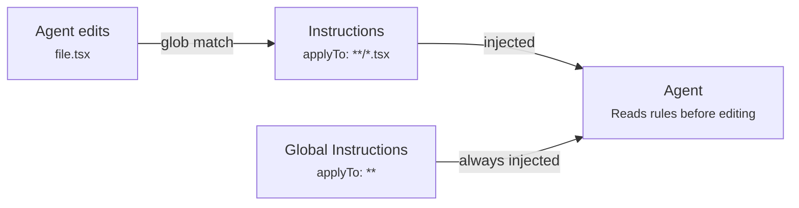
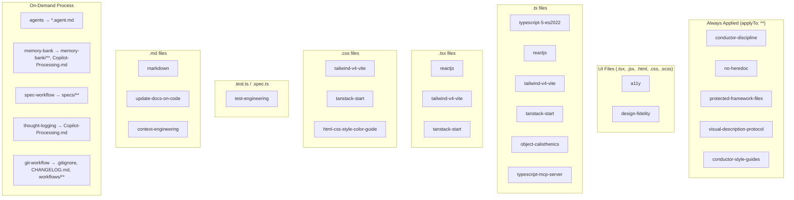

# Available Instructions

Coding standard files in `.github/instructions/`. Each instruction file is automatically applied to matching files via `applyTo` glob patterns. Agents read applicable instructions before editing any file.

> **Context Window Impact**: Only 3 instructions load globally (`conductor-discipline`, `no-heredoc`, `protected-framework-files`). All others are scoped to specific file types, reducing context consumption by ~50-70% on non-UI tasks compared to the previous all-global configuration.

> **Maintenance**: When adding a new instruction, use the `/new-instruction` prompt. platform.system-maintenance will integrate it into the awareness chain automatically.

---

## How Instructions Work

1. Each instruction declares which files it applies to via `applyTo:` in its YAML frontmatter
2. When an agent is about to edit a file, conductor.powder checks which instructions match that file path
3. All matching instruction files are injected into the agent's prompt
4. Instructions with `applyTo: "**"` apply to ALL files — these are global rules

---

## Platform Paths

Instruction files live in different locations depending on the platform. The framework's `install.sh` handles path mapping and any platform-specific flattening automatically.

| Platform                  | Instruction Location                          | Format                                                    |
| ------------------------- | --------------------------------------------- | --------------------------------------------------------- |
| **GitHub Copilot**        | `.github/instructions/<name>.instructions.md` | YAML frontmatter with `applyTo` glob patterns             |
| **Claude Code**           | `.claude/commands/`                           | Flat files — instructions merged and flattened            |
| **Snowflake Cortex Code** | `.cortex/instructions/`                       | Directory copy — instructions stay separate from commands |

The canonical source of truth is always the `.github/instructions/` directory. Platform-specific copies are generated artifacts.

---

## Global Instructions

Apply to **all files** regardless of type. Reserved for safety-critical rules only.

| Instruction                                                                                   | Description                                                                                                                          |
| --------------------------------------------------------------------------------------------- | ------------------------------------------------------------------------------------------------------------------------------------ |
| [`conductor-discipline`](.github/instructions/conductor-discipline.instructions.md)           | Enforces conductor delegation-only discipline — conductor.powder must delegate ALL code and file creation to subagents               |
| [`no-heredoc`](.github/instructions/no-heredoc.instructions.md)                               | Prevents terminal heredoc file corruption — NEVER use cat/echo/heredoc for file creation in VS Code                                  |
| [`protected-framework-files`](.github/instructions/protected-framework-files.instructions.md) | **CRITICAL SAFETY** — prevents agents from deleting, moving, or overwriting Snow Patrol framework files during scaffolding or builds |
| [`visual-description-protocol`](.github/instructions/visual-description-protocol.instructions.md) | Powder Visual Description Protocol v2 — mandatory 10-section format for relaying design mocks to subagents when images cannot be forwarded via runSubagent |
| [`conductor-style-guides`](.github/instructions/conductor-style-guides.instructions.md) | Plan, phase-complete, plan-complete, and git-commit templates used by conductor.powder for orchestration documents |

---

## Scoped Process Instructions

Process and workflow instructions that apply only when editing relevant files.

| Instruction                                                                               | Applies To                                                | Description                                                                          |
| ----------------------------------------------------------------------------------------- | --------------------------------------------------------- | ------------------------------------------------------------------------------------ |
| [`memory-bank`](.github/instructions/memory-bank.instructions.md)                         | `**/memory-bank/**, **/Copilot-Processing.md`             | Memory bank protocol for session continuity across resets                            |
| [`spec-driven-workflow-v1`](.github/instructions/spec-driven-workflow-v1.instructions.md) | `**/specs/**, **/*.prompt.md`                             | Structured development: ANALYZE → DESIGN → IMPLEMENT → VALIDATE → REFLECT → HANDOFF  |
| [`agents`](.github/instructions/agents.instructions.md)                                   | `**/*.agent.md`                                           | Guidelines for creating custom agent files for GitHub Copilot                        |
| [`copilot-thought-logging`](.github/instructions/copilot-thought-logging.instructions.md) | `**/Copilot-Processing.md`                                | Process tracking via Copilot-Processing.md for session visibility                    |
| [`git-workflow`](.github/instructions/git-workflow.instructions.md)                       | `**/.gitignore, **/CHANGELOG.md, **/.github/workflows/**` | Branch naming, Conventional Commits, PR descriptions, merge strategies               |
| [`context-engineering`](.github/instructions/context-engineering.instructions.md)         | `**/*.md, **/.github/**`                                  | Code structure for better AI context — descriptive paths, explicit types, colocation |

---

## UI & Design Instructions

Applied when editing UI files (components, styles, markup).

| Instruction                                                               | Applies To                                           | Description                                                                              |
| ------------------------------------------------------------------------- | ---------------------------------------------------- | ---------------------------------------------------------------------------------------- |
| [`a11y`](.github/instructions/a11y.instructions.md)                       | `**/*.tsx, **/*.jsx, **/*.html, **/*.css, **/*.scss` | WCAG 2.2 Level AA accessibility conformance — semantics, keyboard, contrast, focus, ARIA |
| [`design-fidelity`](.github/instructions/design-fidelity.instructions.md) | `**/*.tsx, **/*.jsx, **/*.css, **/*.scss, **/*.html` | Design fidelity rules — implementations must match provided design mocks exactly         |

---

## Language & Framework Instructions

Applied when editing files matching specific glob patterns.

### TypeScript & JavaScript

| Instruction                                                                                 | Applies To                                                  | Description                                                                 |
| ------------------------------------------------------------------------------------------- | ----------------------------------------------------------- | --------------------------------------------------------------------------- |
| [`typescript-5-es2022`](.github/instructions/typescript-5-es2022.instructions.md)           | `**/*.ts`                                                   | TypeScript 5.x strict mode targeting ES2022 output                          |
| [`reactjs`](.github/instructions/reactjs.instructions.md)                                   | `**/*.jsx, **/*.tsx, **/*.js, **/*.ts, **/*.css, **/*.scss` | React development standards and best practices                              |
| [`nodejs-javascript-vitest`](.github/instructions/nodejs-javascript-vitest.instructions.md) | `**/*.js, **/*.mjs, **/*.cjs`                               | Node.js and JavaScript code with Vitest testing                             |
| [`object-calisthenics`](.github/instructions/object-calisthenics.instructions.md)           | `**/*.{cs,ts,java}`                                         | Object Calisthenics principles for clean, maintainable business domain code |

### Styling & UI

| Instruction                                                                                             | Applies To                                                                       | Description                                                        |
| ------------------------------------------------------------------------------------------------------- | -------------------------------------------------------------------------------- | ------------------------------------------------------------------ |
| [`tailwind-v4-vite`](.github/instructions/tailwind-v4-vite.instructions.md)                             | `vite.config.ts, vite.config.js, **/*.css, **/*.tsx, **/*.ts, **/*.jsx, **/*.js` | Tailwind CSS v4+ with the official `@tailwindcss/vite` plugin      |
| [`tanstack-start-shadcn-tailwind`](.github/instructions/tanstack-start-shadcn-tailwind.instructions.md) | `**/*.ts, **/*.tsx, **/*.js, **/*.jsx, **/*.css, **/*.scss, **/*.json`           | TanStack Start applications with shadcn/ui and Tailwind            |
| [`html-css-style-color-guide`](.github/instructions/html-css-style-color-guide.instructions.md)         | `**/*.html, **/*.css, **/*.js`                                                   | Color usage and styling rules for accessible, professional designs |

### Testing

| Instruction                                                                 | Applies To                                                 | Description                                                            |
| --------------------------------------------------------------------------- | ---------------------------------------------------------- | ---------------------------------------------------------------------- |
| [`test-engineering`](.github/instructions/test-engineering.instructions.md) | `**/*.test.ts, **/*.spec.ts, **/*.test.tsx, **/*.spec.tsx` | Test file structure, naming, assertion patterns, Vitest best practices |

### Infrastructure & Build

| Instruction                                                                           | Applies To                                          | Description                                   |
| ------------------------------------------------------------------------------------- | --------------------------------------------------- | --------------------------------------------- |
| [`typescript-mcp-server`](.github/instructions/typescript-mcp-server.instructions.md) | `**/*.ts, **/*.js, **/package.json`                 | Building MCP servers using the TypeScript SDK |
| [`makefile`](.github/instructions/makefile.instructions.md)                           | `**/Makefile, **/makefile, **/*.mk, **/GNUmakefile` | GNU Make best practices                       |

---

## Documentation & Authoring Instructions

Applied when editing documentation and agent system files.

| Instruction                                                                                     | Applies To                            | Description                                            |
| ----------------------------------------------------------------------------------------------- | ------------------------------------- | ------------------------------------------------------ |
| [`markdown`](.github/instructions/markdown.instructions.md)                                     | `**/*.md`                             | Documentation and content creation standards           |
| [`update-docs-on-code-change`](.github/instructions/update-docs-on-code-change.instructions.md) | `**/*.{md,js,mjs,cjs,ts,tsx,jsx,...}` | Auto-update documentation when code changes require it |
| [`prompt`](.github/instructions/prompt.instructions.md)                                         | `**/*.prompt.md`                      | Guidelines for creating prompt files                   |
| [`instructions`](.github/instructions/instructions.instructions.md)                             | `**/*.instructions.md`                | Guidelines for creating instruction files              |
| [`agent-skills`](.github/instructions/agent-skills.instructions.md)                             | `**/SKILL.md`                         | Guidelines for creating agent skills                   |
| [`task-implementation`](.github/instructions/task-implementation.instructions.md)               | `**/.copilot-tracking/changes/*.md`   | Progressive task tracking with change records          |

---

## File Type Coverage Map

Which instructions fire when you edit different file types:

### Instructions per File Type

| File Pattern  | Instructions Count | Instructions Applied                                                         |
| ------------- | :----------------: | ---------------------------------------------------------------------------- |
| `*.ts`        |         9          | 3 global + typescript, reactjs, tailwind, tanstack, object-calisthenics, mcp |
| `*.tsx`       |         8          | 3 global + a11y, design-fidelity, reactjs, tailwind, tanstack                |
| `*.test.ts`   |         10         | 9 (same as .ts) + test-engineering                                           |
| `*.jsx`       |         8          | 3 global + a11y, design-fidelity, reactjs, tailwind, tanstack                |
| `*.js`        |         10         | 3 global + reactjs, tailwind, tanstack, nodejs-vitest, html-css-color, mcp   |
| `*.css`       |         8          | 3 global + a11y, design-fidelity, tailwind, tanstack, html-css-color         |
| `*.md`        |         6          | 3 global + markdown, update-docs-on-code, context-engineering                |
| `*.html`      |         6          | 3 global + a11y, design-fidelity, html-css-color                             |
| `Makefile`    |         4          | 3 global + makefile                                                          |
| `*.prompt.md` |         7          | 3 global + markdown, update-docs-on-code, prompt, spec-workflow              |
| `SKILL.md`    |         6          | 3 global + markdown, update-docs-on-code, agent-skills                       |
| `*.agent.md`  |         5          | 2 global + markdown, update-docs-on-code, agents                             |

---

## Quick Reference

**Total instructions:** 26

| Category                  | Count | Instructions                                                                                          |
| ------------------------- | ----- | ----------------------------------------------------------------------------------------------------- |
| Global (all files)        | 2     | no-heredoc, protected-framework-files                                                                 |
| Scoped Process            | 6     | memory-bank, spec-driven-workflow, agents, copilot-thought-logging, git-workflow, context-engineering |
| UI & Design               | 2     | a11y, design-fidelity                                                                                 |
| TypeScript & JavaScript   | 4     | typescript-5-es2022, reactjs, nodejs-javascript-vitest, object-calisthenics                           |
| Styling & UI              | 3     | tailwind-v4-vite, tanstack-start-shadcn-tailwind, html-css-style-color-guide                          |
| Testing                   | 1     | test-engineering                                                                                      |
| Infrastructure & Build    | 2     | typescript-mcp-server, makefile                                                                       |
| Documentation & Authoring | 6     | markdown, update-docs-on-code-change, prompt, instructions, agent-skills, task-implementation         |

### Adding a New Instruction

1. Run `/new-instruction` in Copilot Chat
2. Provide the instruction purpose, target file patterns, and rules
3. conductor.powder creates the .instructions.md file and invokes platform.system-maintenance to integrate it
4. platform.system-maintenance updates copilot.instructions.md and conductor.powder's instruction mappings
5. The instruction is immediately applied on next file edit
