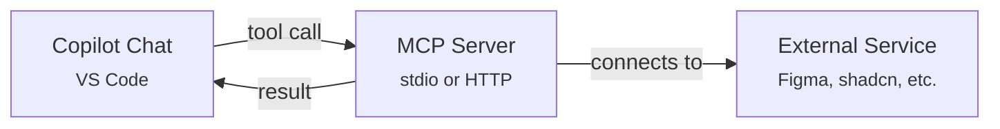
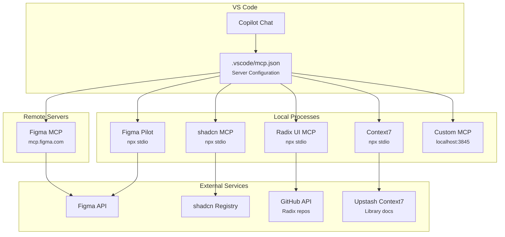
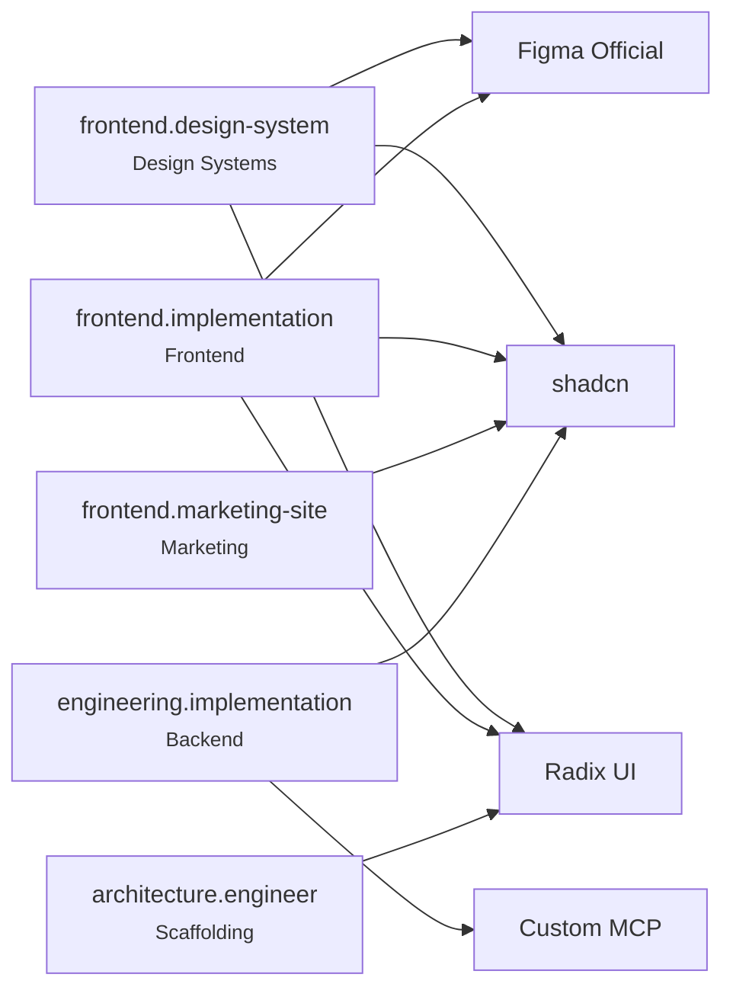

# Available MCP Servers

Model Context Protocol (MCP) servers configured in `.vscode/mcp.json`. These extend Copilot's capabilities with external tool integrations — design tools, component libraries, and custom services.

---

## How MCP Servers Work



1. MCP servers are defined in `.vscode/mcp.json`
2. When Copilot needs an external capability, it calls the MCP server's tools
3. The server connects to the external service and returns results
4. Agents (especially frontend.design-system and frontend.implementation) use MCP tools during UI work

---

## Platform Compatibility

MCP server configuration varies across supported platforms:

| Platform                  | MCP Config Location                                | Notes                                      |
| ------------------------- | -------------------------------------------------- | ------------------------------------------ |
| **VS Code / Copilot**     | `.vscode/mcp.json`                                 | Primary platform; fully supported          |
| **Claude Code**           | `.claude/mcp.json` or `claude_desktop_config.json` | Platform-specific format; see Claude docs  |
| **Snowflake Cortex Code** | Varies by version                                  | MCP support depends on Cortex Code version |
| **Cursor**                | `.cursor/mcp.json`                                 | Project-specific MCP config supported      |

- The server catalog and tool descriptions on this page apply regardless of platform — what changes is _where_ the configuration lives.
- The framework's `install.sh` handles VS Code MCP config (`.vscode/mcp.json`) automatically for Copilot installs and Cursor MCP config (`.cursor/mcp.json`) for Cursor installs.
- **Claude Code** and **Cortex Code** users should configure MCP servers according to their platform's documentation using the server IDs, commands, and auth details listed below.

---

## Configured Servers

### Figma (Official)

| Property      | Value                                          |
| ------------- | ---------------------------------------------- |
| **Server ID** | `com.figma.mcp/mcp`                            |
| **Type**      | HTTP (remote)                                  |
| **URL**       | `https://mcp.figma.com/mcp`                    |
| **Auth**      | OAuth — browser-based Figma login on first use |
| **Version**   | 1.0.3                                          |

**What it provides:**

- Read Figma file structure, pages, and frames
- Extract component properties, styles, and design tokens
- Get layout information, spacing, typography, and color values
- Read comments and annotations from Figma files
- Access to any file your Figma account can view
- **Write designs to Figma** — `generate_figma_design` sends live UI as design layers to new or existing files and is the authoritative first capture step when mirroring a running localhost or live web app
- **General-purpose Figma editing** — `use_figma` creates, edits, deletes, or inspects any Figma object (frames, components, variants, variables, styles, text, images); for live app capture workflows it is used only after `generate_figma_design` for cleanup and refinement
- **Search design libraries** — `search_design_system` finds reusable components, variables, and styles across connected libraries
- **Create new files** — `create_new_file` creates blank Figma Design or FigJam files in user's drafts

**Used by:** frontend.design-system (design system audits), design.visual-designer (visual specs), frontend.implementation (design-to-code), conductor.powder (UI planning)

**Setup:** No configuration needed. On first use, VS Code opens a browser for Figma OAuth authorization. Your login persists until the token expires. For running-app-to-Figma workflows, if the Figma MCP is disconnected or the source app is unavailable, the workflow is BLOCKED rather than reconstructed from placeholders.

---

### Figma Pilot (Legacy — removed from mcp.json)

| Property      | Value                                                                                                           |
| ------------- | --------------------------------------------------------------------------------------------------------------- |
| **Server ID** | `figma-pilot`                                                                                                   |
| **Type**      | stdio (local process)                                                                                           |
| **Command**   | `npx @youware-labs/figma-pilot-mcp`                                                                             |
| **Auth**      | Figma Personal Access Token (environment variable)                                                              |
| **Status**    | **Superseded and removed** — all agents use the official Figma MCP; figma-pilot removed from `.vscode/mcp.json` |

**What it provided:**

- `figma_execute` — Programmatic Figma API access with structured queries
- Advanced component inspection and property extraction
- Batch operations across multiple Figma nodes
- Design token extraction in structured formats

**Note:** All agent workflows use the official Figma MCP (`figma`). The figma-pilot server has been removed from `.vscode/mcp.json`. The legacy skill files at `.github/skills/figma-pilot/` are retained for reference only.

**Setup (if re-enabling):**

1. Generate a Personal Access Token in Figma: Settings → Account → Personal access tokens
2. Set the environment variable: `FIGMA_TOKEN=<your-token>`
3. The skill at `.github/skills/figma-pilot/SKILL.md` documents the API syntax

---

### shadcn/ui

| Property      | Value                   |
| ------------- | ----------------------- |
| **Server ID** | `shadcn`                |
| **Type**      | stdio (local process)   |
| **Command**   | `npx shadcn@latest mcp` |
| **Auth**      | None required           |

**What it provides:**

- Browse available shadcn/ui components and their variants
- Get component source code and installation commands
- View component examples and usage patterns
- Check which components are already installed in the project
- Search the shadcn registry for components matching a need

**Used by:** frontend.implementation (component implementation), frontend.design-system (component audits), engineering.implementation (UI work)

**Setup:** No configuration needed. Runs locally via npx. Requires Node.js 18+.

---

### Radix UI MCP Server

| Property      | Value                                              |
| ------------- | -------------------------------------------------- |
| **Server ID** | `radix-ui`                                         |
| **Type**      | stdio (local process)                              |
| **Command**   | `npx @gianpieropuleo/radix-mcp-server@latest`      |
| **Auth**      | None required (optional `--github-api-key` flag)   |
| **Source**    | https://github.com/gianpieropuleo/radix-mcp-server |
| **License**   | MIT (community-maintained, not official Radix)     |

**What it provides:**

AI access to Radix UI libraries — Themes, Primitives, and Colors.

- **Radix Themes:** `themes_list_components`, `themes_get_component_source`, `themes_get_component_documentation`, `themes_get_getting_started`
- **Radix Primitives:** `primitives_list_components`, `primitives_get_component_source`, `primitives_get_component_documentation`, `primitives_get_getting_started`
- **Radix Colors:** `colors_list_scales`, `colors_get_scale`, `colors_get_scale_documentation`, `colors_get_getting_started`

**Used by:** frontend.design-system (design system auditing), frontend.implementation (frontend implementation), `architecture.engineer` (scaffolding)

**Relationship with shadcn MCP:** Use the shadcn MCP for styled components and the Radix UI MCP for primitives and the color system. They complement each other.

**Setup:** No configuration needed. Runs locally via npx. Requires Node.js 18+.

Optionally, pass a GitHub API token for higher rate limits (60 requests/hr without, 5000/hr with):

```json
"args": ["@gianpieropuleo/radix-mcp-server@latest", "--github-api-key", "YOUR_TOKEN"]
```

---

### Custom MCP Server (Local Development)

| Property      | Value                       |
| ------------- | --------------------------- |
| **Server ID** | `my-mcp-server-b60d39dc`    |
| **Type**      | HTTP (local)                |
| **URL**       | `http://127.0.0.1:3845/mcp` |
| **Auth**      | None (localhost)            |

**What it provides:** Custom tools defined by the locally running MCP server. This entry is for local development and testing of custom MCP servers.

**Setup:** Start your MCP server on port 3845 before using. See the `typescript-mcp-server` instruction for building MCP servers.

---

### Context7 (Upstash)

| Property      | Value                               |
| ------------- | ----------------------------------- |
| **Server ID** | `context7`                          |
| **Type**      | stdio (local process)               |
| **Command**   | `npx -y @upstash/context7-mcp`      |
| **Auth**      | API key (environment variable)      |
| **Source**    | https://github.com/upstash/context7 |

**What it provides:**

AI-native documentation and context lookup for libraries and frameworks. Instead of searching docs manually, agents can query Context7 for up-to-date API references, usage examples, and best practices for any supported library.

- Look up library documentation with version-aware context
- Get code examples and API references for specific packages
- Resolve ambiguity about library usage patterns
- Access community-curated knowledge bases

**Used by:** All agents that need to look up library or framework documentation during implementation.

**Setup:**

1. Obtain a Context7 API key from Upstash
2. The key is configured in `.vscode/mcp.json` via the `--api-key` argument
3. Runs locally via npx. Requires Node.js 18+.

---

## Server Comparison

| Server               | Type          | Auth    | Scope         | Primary Use                                                           |
| -------------------- | ------------- | ------- | ------------- | --------------------------------------------------------------------- |
| **Figma (Official)** | HTTP (remote) | OAuth   | Design files  | Read Figma designs, extract tokens, Code Connect, design system rules |
| **Figma Pilot**      | stdio (local) | Token   | Design files  | Legacy — programmatic Figma API with `figma_execute` (superseded)     |
| **shadcn/ui**        | stdio (local) | None    | Component lib | Browse, search, and install shadcn components                         |
| **Radix UI**         | stdio (local) | None    | Component lib | Access Radix Themes, Primitives, and Colors                           |
| **Context7**         | stdio (local) | API key | Documentation | AI-native library docs and context lookup                             |
| **Custom**           | HTTP (local)  | None    | Custom tools  | Local MCP server development and testing                              |

---

## Architecture



### Agent-MCP Relationships



---

## Quick Reference

**Total MCP servers:** 6

| Category            | Count | Servers                                         |
| ------------------- | ----- | ----------------------------------------------- |
| Design Tools        | 2     | Figma (Official, primary), Figma Pilot (legacy) |
| Component Libraries | 2     | shadcn/ui, Radix UI                             |
| Documentation       | 1     | Context7 (Upstash)                              |
| Development         | 1     | Custom MCP (local)                              |

### Adding a New MCP Server

1. Edit `.vscode/mcp.json` and add a new entry under `"servers"`
2. For HTTP servers: specify `"type": "http"` and `"url"`
3. For stdio servers: specify `"type": "stdio"`, `"command"`, and `"args"`
4. If auth is needed: configure environment variables or OAuth
5. Restart VS Code to pick up the new server
6. Update this document with the new server details
