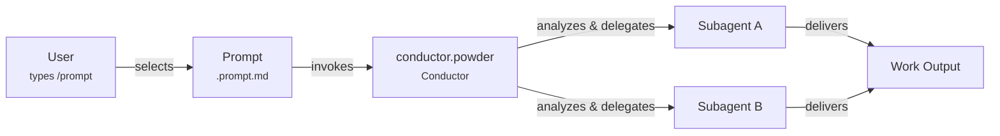
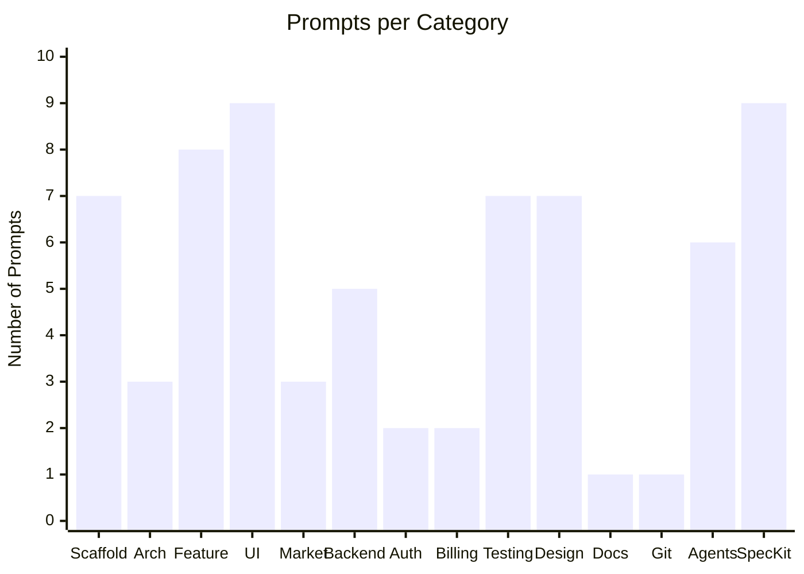
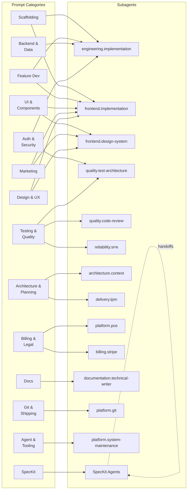
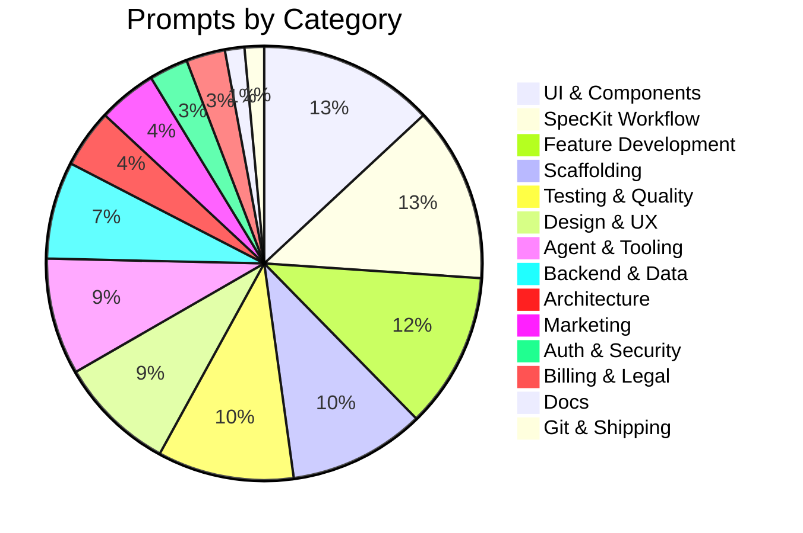

# Available Prompts

All available slash-command prompts in `.github/prompts/`. Use these by typing `/` in Copilot Chat and selecting the prompt name.

> **Maintenance**: When adding a new prompt, add it to the appropriate category below. The [new-prompt](.github/prompts/new-prompt.prompt.md) workflow includes this step automatically.

---

## How Prompts Work

1. The user types `/` in Copilot Chat and selects a prompt
2. The prompt provides structured instructions and the user's `{{input}}`
3. conductor.powder receives the request and orchestrates the work
4. She delegates tasks to the appropriate subagents based on the prompt category
5. Subagents execute their specialties and produce the final output

## Execution Modes

Compatible build and feature prompts support an optional `--auto` suffix.

- default: `@conductor.powder /build-full-stack-feature <feature description>`
- auto: `@conductor.powder /build-full-stack-feature <feature description> --auto`

In `--auto`, Powder continues automatically through soft workflow gates and approval pauses, but still runs the gates and records findings for the next iteration. Hard safety hooks remain unchanged.

---

## Categories

- [Application Scaffolding](#application-scaffolding)
- [Architecture & Planning](#architecture--planning)
- [Feature Development](#feature-development)
- [UI & Components](#ui--components)
- [Marketing & Landing Pages](#marketing--landing-pages)
- [Backend & Data](#backend--data)
- [Authentication & Security](#authentication--security)
- [Billing & Legal](#billing--legal)
- [Testing & Quality](#testing--quality)
- [Design & UX](#design--ux)
- [Documentation & Maintenance](#documentation--maintenance)
- [Git & Shipping](#git--shipping)
- [Agent & Tooling Management](#agent--tooling-management)
- [SpecKit Workflow](#speckit-workflow)

---

## Application Scaffolding

Prompts for bootstrapping new projects and setting up foundational infrastructure.

| Prompt                    | Description                                                                                                                                                                                                  |
| ------------------------- | ------------------------------------------------------------------------------------------------------------------------------------------------------------------------------------------------------------ |
| `ship-application`        | End-to-end application build workflow — discovery through launch with design fidelity gates (design.visual-designer visual specs, Figma component library, Storybook, mobile/tablet breakpoint verification) |
| `scaffold-new-app`        | Scaffold a new full-stack application with Firebase + React + TypeScript                                                                                                                                     |
| `architect-new-project`   | Plan the architecture for a new project before any PRD, features, or scaffolding — establish frontend + backend foundations                                                                                  |
| `scaffold-firebase-setup` | Initialize Firebase project with Auth, Firestore, Functions, and Hosting                                                                                                                                     |
| `scaffold-monorepo`       | Set up a pnpm monorepo workspace with shared packages                                                                                                                                                        |
| `setup-cicd-deployment`   | Set up CI/CD pipeline with Firebase deployment                                                                                                                                                               |
| `setup-state-management`  | Set up state management with Zustand stores and TanStack Query                                                                                                                                               |

## Architecture & Planning

Prompts for high-level planning, specification, and strategic thinking.

| Prompt                       | Description                                                                     |
| ---------------------------- | ------------------------------------------------------------------------------- |
| `feature-from-idea`          | Turn a feature idea into a full specification, plan, and task list              |
| `critical-thinking-review`   | Challenge assumptions about a product idea, architecture, or technical decision |
| `value-realization-analysis` | Evaluate whether users will discover clear value in a product idea              |

## Feature Development

Prompts for building complete features end-to-end.

| Prompt                     | Description                                                                                                                                                              |
| -------------------------- | ------------------------------------------------------------------------------------------------------------------------------------------------------------------------ |
| `build-full-stack-feature` | Build a complete full-stack feature with all gates — design.visual-designer visual specs, Storybook stories, code review, security + accessibility + mobile verification |
| `build-page`               | Create a new page/route with layout, data loading, and error handling                                                                                                    |
| `build-realtime-feature`   | Build real-time features using Firestore listeners and live updates                                                                                                      |
| `build-search`             | Implement search functionality with Firestore queries and UI                                                                                                             |
| `build-notifications`      | Implement toast notifications, alerts, and real-time notification system                                                                                                 |
| `build-file-upload`        | Implement file upload with storage rules, progress tracking, and image processing                                                                                        |
| `build-email-system`       | Implement transactional email system with templates and delivery tracking                                                                                                |
| `api-integration`          | Integrate a third-party API or external service with proper error handling                                                                                               |

## UI & Components

Prompts for building user interface elements, components, and interactive patterns.

| Prompt                    | Description                                                                  |
| ------------------------- | ---------------------------------------------------------------------------- |
| `build-ui-component`      | Build a new UI component following design system patterns with TDD           |
| `build-component-library` | Build a reusable component library with Storybook, tokens, and documentation |
| `build-dashboard`         | Build a dashboard layout with data visualization, stats, and widgets         |
| `build-data-table`        | Build a sortable, filterable, paginated data table with accessible markup    |
| `build-form`              | Build an accessible, validated form with proper error handling               |
| `build-wizard`            | Build a multi-step wizard/stepper with validation, back/next, and progress   |
| `build-navigation`        | Build navigation with sidebar, breadcrumbs, and responsive mobile menu       |
| `build-onboarding`        | Design and build user onboarding flow with progressive disclosure            |
| `add-animations`          | Add polished animations and transitions to UI components                     |

## Marketing & Landing Pages

Prompts for public-facing marketing pages, pricing, and conversion-optimized content.

| Prompt                 | Description                                                                                             |
| ---------------------- | ------------------------------------------------------------------------------------------------------- |
| `build-marketing-site` | Build a complete marketing site with landing page, pricing, features, and conversion-optimized sections |
| `build-landing-page`   | Build a conversion-optimized landing page with hero, features, social proof, and CTAs                   |
| `build-pricing-page`   | Build a pricing page with tier cards, billing toggle, feature comparison, and FAQ                       |

## Backend & Data

Prompts for backend logic, data modeling, and cloud functions.

| Prompt                    | Description                                                                                   |
| ------------------------- | --------------------------------------------------------------------------------------------- |
| `build-firestore-model`   | Design and implement a Firestore data model with security rules                               |
| `build-cloud-function`    | Create a Cloud Function with auth, validation, rate limiting, and tests                       |
| `build-multi-tenant`      | Implement multi-tenant architecture with workspace isolation                                  |
| `build-mcp-server`        | Build an MCP server with tools, resources, and prompts using TypeScript SDK                   |
| `generate-synthetic-data` | Generate realistic synthetic data for demos, testing, Storybook stories, and dev environments |

## Authentication & Security

Prompts for auth flows, security audits, and access control.

| Prompt            | Description                                                                      |
| ----------------- | -------------------------------------------------------------------------------- |
| `build-auth-flow` | Implement authentication flow with Firebase Auth, RBAC, and tenant isolation     |
| `security-audit`  | Run a comprehensive security audit on Firestore rules, Cloud Functions, and auth |

## Billing & Legal

Prompts for payment integration and legal compliance documents.

| Prompt                 | Description                                                              |
| ---------------------- | ------------------------------------------------------------------------ |
| `setup-stripe-billing` | Set up Stripe billing with subscriptions, checkout, and customer portal  |
| `draft-legal-docs`     | Draft Terms of Service, Privacy Policy, and Cookie Policy for a SaaS app |

## Testing & Quality

Prompts for writing tests, debugging, performance, and code quality.

| Prompt                     | Description                                                                                     |
| -------------------------- | ----------------------------------------------------------------------------------------------- |
| `write-tests-tdd`          | Write tests for a feature using TDD with Vitest and React Testing Library                       |
| `fix-bug`                  | Fix a bug using Quick Fix workflow — diagnose root cause, regression test, surgical fix, verify |
| `code-review`              | Review code changes for correctness, quality, test coverage, and best practices                 |
| `performance-optimization` | Analyze and improve application performance (frontend and backend)                              |
| `refactor-tech-debt`       | Identify and refactor technical debt, code smells, and quality issues                           |
| `dependency-maintenance`   | Update dependencies, fix vulnerabilities, and maintain the codebase                             |

## Design & UX

Prompts for design system work, Figma integration, accessibility, and UX research.

| Prompt                            | Description                                                                                                                                                                                                                                                                             |
| --------------------------------- | --------------------------------------------------------------------------------------------------------------------------------------------------------------------------------------------------------------------------------------------------------------------------------------- |
| `design-foundation`               | Establish visual identity, design system theme, UI mocks, and marketing/landing experience before building features                                                                                                                                                                     |
| `design-to-code`                  | Convert a Figma design into implementation-ready code with design system alignment                                                                                                                                                                                                      |
| `audit-design-system`             | Audit and sync Figma designs with codebase components and tokens                                                                                                                                                                                                                        |
| `accessibility-audit`             | Run WCAG 2.1/2.2 accessibility audit on UI components or pages                                                                                                                                                                                                                          |
| `fix-accessibility`               | Fix accessibility issues identified in an audit or reported by users                                                                                                                                                                                                                    |
| `browser-agent-testing`           | Run automated browser agent testing on a running application — forms, layouts, auth, a11y, e2e journeys, and when needed the capture handoff package for `generate_figma_design`                                                                                                        |
| `capture-app-to-figma`            | Capture a running application into Figma using `generate_figma_design` with live browser capture. Discovers routes, injects Figma capture script, captures each screen, verifies with screenshots, reverts script injection, then performs narrower post-capture cleanup and refinement |
| `codebase-to-figma-design-system` | Capture the running localhost app into Figma with `generate_figma_design`, keep all reachable screens and layouts, then build a full design-system structure in the same file with tokens, primitives, components, patterns, layouts, and screens using `use_figma`                     |
| `ux-research-personas`            | Create data-driven user personas and customer journey maps                                                                                                                                                                                                                              |

## Documentation & Maintenance

Prompts for generating and updating project documentation.

| Prompt          | Description                                                         |
| --------------- | ------------------------------------------------------------------- |
| `generate-docs` | Generate or update API documentation, README, and architecture docs |

## Git & Shipping

Prompts for version control workflows and deployment.

| Prompt      | Description                                                                                |
| ----------- | ------------------------------------------------------------------------------------------ |
| `ship-code` | Branch, commit, PR, and merge workflow using @platform.git — from working code to mainline |

## Agent & Tooling Management

Prompts for creating and managing the Snow Patrol agent architecture itself.

| Prompt                | Description                                                                                                               |
| --------------------- | ------------------------------------------------------------------------------------------------------------------------- |
| `new-agent`           | Create a new standalone agent and integrate it into the Snow Patrol system via platform.system-maintenance                |
| `new`                 | Create a new conductor.powder-orchestrated subagent with full awareness chain integration via platform.system-maintenance |
| `new-skill`           | Create a new agent skill and integrate it into the Snow Patrol agent chain via platform.system-maintenance                |
| `new-instruction`     | Create a new coding instruction file and integrate it into the Snow Patrol agent chain via platform.system-maintenance    |
| `new-prompt`          | Create a new prompt file and optionally integrate it into workflows via platform.system-maintenance                       |

## SpecKit Workflow

Sequential pipeline for specification-driven feature development. These prompts keep their manual slash-command names, but they now enter through `conductor.powder`, which delegates to the dedicated SpecKit specialists and preserves `plans/powder-active-task-plan.md` across stages.

| Prompt                  | Agent                                       | Description                                                     |
| ----------------------- | ------------------------------------------- | --------------------------------------------------------------- |
| `speckit.constitution`  | `conductor.powder -> speckit.constitution`  | Define project principles and global constraints                |
| `speckit.specify`       | `conductor.powder -> speckit.specify`       | Create feature spec with user stories and acceptance criteria   |
| `speckit.clarify`       | `conductor.powder -> speckit.clarify`       | Identify underspecified areas and encode answers back into spec |
| `speckit.plan`          | `conductor.powder -> speckit.plan`          | Generate implementation plan from spec                          |
| `speckit.tasks`         | `conductor.powder -> speckit.tasks`         | Break plan into ordered, parallelizable tasks                   |
| `speckit.implement`     | `conductor.powder -> speckit.implement`     | Execute tasks in phases                                         |
| `speckit.analyze`       | `conductor.powder -> speckit.analyze`       | Cross-artifact consistency and quality check                    |
| `speckit.checklist`     | `conductor.powder -> speckit.checklist`     | Generate custom checklist for current feature                   |
| `speckit.taskstoissues` | `conductor.powder -> speckit.taskstoissues` | Convert tasks into GitHub issues                                |

> **Agent handoffs in SpecKit:** Powder owns the user-facing loop and can still delegate to the underlying SpecKit agents, which keep their stage-specific handoffs. The practical effect is the same stage progression, but the active task capsule stays with Powder instead of hopping between top-level agents.

---

## Prompts by Category

Distribution of prompts across all 14 categories:

---

## Prompt-to-Agent Routing

Which prompt categories tend to trigger which subagents when conductor.powder orchestrates:

**Reading the graph:** Each left-side node is a prompt category; each right-side node is a subagent. An arrow means conductor.powder typically delegates prompts from that category to that subagent. frontend.implementation and engineering.implementation are the densest hubs — they handle build, scaffolding, and UI prompts across multiple categories.

---

## Quick Reference

**Total prompts:** 69

| Category                    | Count |
| --------------------------- | ----- |
| Application Scaffolding     | 7     |
| Architecture & Planning     | 3     |
| Feature Development         | 8     |
| UI & Components             | 9     |
| Marketing & Landing Pages   | 3     |
| Backend & Data              | 5     |
| Authentication & Security   | 2     |
| Billing & Legal             | 2     |
| Testing & Quality           | 7     |
| Design & UX                 | 6     |
| Documentation & Maintenance | 1     |
| Git & Shipping              | 1     |
| Agent & Tooling Management  | 6     |
| SpecKit Workflow            | 9     |

### Category Distribution

Prompts sorted by count (descending) with percentage of total:

| Category                    | Count | % of Total |
| --------------------------- | :---: | :--------: |
| UI & Components             |   9   |   13.0%    |
| SpecKit Workflow            |   9   |   13.0%    |
| Feature Development         |   8   |   11.6%    |
| Application Scaffolding     |   7   |   10.1%    |
| Testing & Quality           |   7   |   10.1%    |
| Design & UX                 |   6   |    8.7%    |
| Agent & Tooling Management  |   6   |    8.7%    |
| Backend & Data              |   5   |    7.2%    |
| Architecture & Planning     |   3   |    4.3%    |
| Marketing & Landing Pages   |   3   |    4.3%    |
| Authentication & Security   |   2   |    2.9%    |
| Billing & Legal             |   2   |    2.9%    |
| Documentation & Maintenance |   1   |    1.4%    |
| Git & Shipping              |   1   |    1.4%    |

### How to Use

1. Open Copilot Chat
2. Type `/` to see available prompts
3. Select a prompt and provide the `{{input}}` it requests
4. Most prompts use `@conductor.powder` for orchestration — she delegates to the right subagents automatically

### Adding a New Prompt

When creating a new prompt, update this catalog:

1. Add the prompt to the appropriate category table above
2. Update the **Total prompts** count in Quick Reference
3. Update the category count if it changed
4. If the prompt establishes a new category, add the category to the Table of Contents and create a new section
