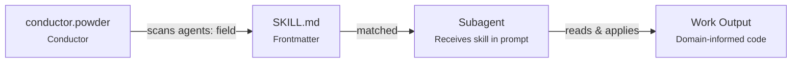
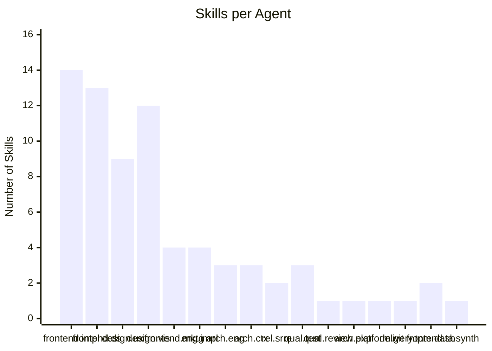
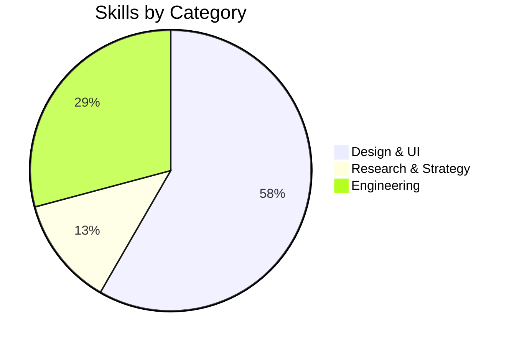

# Available Skills

Domain-specific knowledge packages in `.github/skills/`. Each skill provides deep expert knowledge that agents use when working in that domain. conductor.powder automatically injects matching skills into subagent prompts based on the `agents:` field in each skill's frontmatter.

> **Maintenance**: When adding a new skill, use the `/new-skill` prompt. platform.system-maintenance will integrate it into the awareness chain automatically.

---

## How Skills Work

1. Each skill declares which agents should receive it via `agents:` in its YAML frontmatter
2. When conductor.powder delegates work, she checks which skills target the subagent
3. Matching skill file paths are injected into the subagent's prompt
4. The subagent reads the skill and applies its knowledge to the task

> **Agent handoffs:** Agents equipped with skills can now hand off to other skill-equipped agents via `handoffs:` frontmatter. This enables seamless transitions between specialized agents — for example, a design agent with `design-system` skills can hand off to an implementation agent that receives the same skill context. See [How To: Update Agents](how-to-update-agents.md#scenario-6-adding-handoffs-to-an-agent) for details.

---

## Skill Catalog

### Design & UI

| Skill                                                                            | Target Agents                                                                                                        | Description                                                                                                                                                                                                                                                                               |
| -------------------------------------------------------------------------------- | -------------------------------------------------------------------------------------------------------------------- | ----------------------------------------------------------------------------------------------------------------------------------------------------------------------------------------------------------------------------------------------------------------------------------------- |
| [`design-system`](.github/skills/design-system/SKILL.md)                         | frontend.design-system, frontend.implementation, `architecture.engineer`, design.visual-designer, frontend.storybook | Design system for generating consistent, production-grade SaaS UI. Tokens, components, layouts, color rules, typography — "clean authority" aesthetic.                                                                                                                                    |
| [`animation-designer`](.github/skills/animation-designer/SKILL.md)               | frontend.implementation, design.ux-engineer                                                                          | Framer Motion patterns, CSS transitions, motion design principles for polished UI interactions.                                                                                                                                                                                           |
| [`figma-pilot`](.github/skills/figma-pilot/SKILL.md)                             | frontend.design-system                                                                                               | Legacy Figma MCP API syntax and examples. Agents now use the official Figma MCP; this skill is retained for reference.                                                                                                                                                                    |
| [`figma-file-creation`](.github/skills/figma-file-creation/SKILL.md)             | frontend.design-system, design.visual-designer                                                                       | Official Figma MCP workflow for creating new Figma Design and FigJam files, resolving `planKey`, and bootstrapping a fresh draft before sync work. For running-app capture, create the file and then capture reachable routes/states with `generate_figma_design` before any refinement.  |
| [`figma-use`](.github/skills/figma-use/SKILL.md)                                 | frontend.design-system, design.visual-designer                                                                       | Critical `use_figma` Plugin API rules, incremental workflow, error recovery, and screen composition from design system components. MUST load before any `use_figma` call. For faithfully mirroring a running app, `use_figma` is post-capture cleanup only after `generate_figma_design`. |
| [`figma-read-design`](.github/skills/figma-read-design/SKILL.md)                 | frontend.design-system, design.visual-designer, frontend.implementation                                              | Read existing Figma designs via `get_design_context`, `get_screenshot`, `get_metadata`, and `search_design_system` for design-to-code and QA workflows.                                                                                                                                   |
| [`elegant-design`](.github/skills/elegant-design/SKILL.md)                       | design.visual-designer, frontend.implementation, design.ux-engineer, frontend.design-system, frontend.marketing-site | World-class accessible responsive interfaces with interactive elements (chat, terminals, code display, streaming content).                                                                                                                                                                |
| [`frontend-design`](.github/skills/frontend-design/SKILL.md)                     | design.visual-designer, frontend.implementation, frontend.marketing-site, design.ux-engineer                         | Distinctive, production-grade frontend interfaces with high design quality, avoiding generic AI aesthetics.                                                                                                                                                                               |
| [`interaction-design`](.github/skills/interaction-design/SKILL.md)               | frontend.implementation, design.visual-designer, design.ux-engineer, frontend.design-system                          | Design and implement microinteractions, motion design, transitions, and user feedback patterns.                                                                                                                                                                                           |
| [`interface-design`](.github/skills/interface-design/SKILL.md)                   | frontend.implementation, design.visual-designer, design.ux-engineer, frontend.design-system                          | Interface design — dashboards, admin panels, apps, tools, and interactive products.                                                                                                                                                                                                       |
| [`marketing-site`](.github/skills/marketing-site/SKILL.md)                       | frontend.marketing-site, frontend.implementation, frontend.design-system                                             | Marketing page layouts, conversion patterns, pricing components, pre-auth UI, social proof, CTAs.                                                                                                                                                                                         |
| [`product-designer`](.github/skills/product-designer/SKILL.md)                   | frontend.implementation, design.ux-engineer, frontend.design-system, design.visual-designer                          | UI/UX design process, design thinking, prototyping, user research methodology.                                                                                                                                                                                                            |
| [`tailwind-design-system`](.github/skills/tailwind-design-system/SKILL.md)       | frontend.implementation, frontend.design-system, design.visual-designer, frontend.marketing-site                     | Build scalable design systems with Tailwind CSS v4, design tokens, component libraries, and responsive patterns.                                                                                                                                                                          |
| [`visual-design-foundations`](.github/skills/visual-design-foundations/SKILL.md) | design.visual-designer, frontend.implementation, frontend.design-system, design.ux-engineer                          | Apply typography, color theory, spacing systems, and iconography principles to create cohesive visual designs.                                                                                                                                                                            |

### Research & Strategy

| Skill                                                                            | Target Agents                                                                                            | Description                                                                                                               |
| -------------------------------------------------------------------------------- | -------------------------------------------------------------------------------------------------------- | ------------------------------------------------------------------------------------------------------------------------- |
| [`remembering-conversations`](.github/skills/remembering-conversations/SKILL.md) | _(all agents)_                                                                                           | Search past conversation history when user asks 'how should I...' or references past work. Searches conversation history. |
| [`ux-researcher-designer`](.github/skills/ux-researcher-designer/SKILL.md)       | design.ux-engineer, architecture.context                                                                 | Data-driven persona generation, journey mapping, usability testing frameworks, research synthesis.                        |
| [`value-realization`](.github/skills/value-realization/SKILL.md)                 | architecture.context, delivery.tpm, design.ux-engineer, frontend.implementation, `architecture.engineer` | Analyze whether users will discover clear value in product ideas. Product-market fit, adoption, positioning.              |

### Engineering

| Skill                                                            | Target Agents                                                                                                                                                                                                                                | Description                                                                                                                                                                                                                                                                 |
| ---------------------------------------------------------------- | -------------------------------------------------------------------------------------------------------------------------------------------------------------------------------------------------------------------------------------------- | --------------------------------------------------------------------------------------------------------------------------------------------------------------------------------------------------------------------------------------------------------------------------- |
| [`bug-fix`](.github/skills/bug-fix/SKILL.md)                     | reliability.srre, engineering.implementation                                                                                                                                                                                                 | Systematic debugging methodology — RCA framework, diagnostic patterns, 5 Whys, regression prevention for TypeScript/React/Firebase apps.                                                                                                                                    |
| [`browser-testing`](.github/skills/browser-testing/SKILL.md)     | frontend.browsertesting, frontend.implementation, quality.code-review                                                                                                                                                                        | Automated browser agent testing — visual rendering, form validation, responsive layout, auth flows, accessibility, e2e user journeys. For live app to Figma workflows, it also produces the capture handoff evidence and returns BLOCKED when localhost cannot be verified. |
| [`git-workflow`](.github/skills/git-workflow/SKILL.md)           | platform.git                                                                                                                                                                                                                                 | Branch management, commit crafting, PR creation, change analysis, merge strategies.                                                                                                                                                                                         |
| [`project-decisions`](.github/skills/project-decisions/SKILL.md) | engineering.implementation, frontend.implementation, architecture.engineer, quality.test-architecture, reliability.srre, design.visual-designer, frontend.design-system, quality.code-review, architecture.exploration, architecture.context | Consolidated project-level architectural decisions, technology choices, and coding conventions.                                                                                                                                                                             |
| [`symphony-setup`](.github/skills/symphony-setup/SKILL.md)       | _(manual/top-level use)_                                                                                                                                                                                                                     | Set up Symphony for a repo, including Codex orchestration, Linear integration, prerequisites, and workflow configuration.                                                                                                                                                   |
| [`test-engineering`](.github/skills/test-engineering/SKILL.md)   | quality.test-architecture, engineering.implementation                                                                                                                                                                                        | Spec-driven test generation, coverage analysis, mocking strategies, Vitest patterns.                                                                                                                                                                                        |
| [`synthetic-data`](.github/skills/synthetic-data/SKILL.md)       | data.synthetic, engineering.implementation, frontend.implementation, frontend.storybook, quality.test-architecture                                                                                                                           | Realistic synthetic data generation — Faker.js factory patterns, relationship graphs, volume profiles, temporal consistency, Storybook fixtures, and seed scripts.                                                                                                          |

### Backend & Ops

| Skill                                                              | Target Agents                                                                             | Description                                                                                                                                                |
| ------------------------------------------------------------------ | ----------------------------------------------------------------------------------------- | ---------------------------------------------------------------------------------------------------------------------------------------------------------- |
| [`api-design`](.github/skills/api-design/SKILL.md)                 | engineering.implementation, architecture.engineer, quality.code-review                    | REST/GraphQL patterns — resource modeling, versioning, pagination, error contracts, idempotency, rate limiting, HTTP semantics.                            |
| [`security-hardening`](.github/skills/security-hardening/SKILL.md) | security.application, engineering.implementation, architecture.engineer, quality.code-review | OWASP Top 10 mitigation, input validation, auth patterns, secrets management, dependency security, secure defaults.                                        |
| [`database-modeling`](.github/skills/database-modeling/SKILL.md)   | engineering.implementation, architecture.engineer, quality.code-review                    | SQL and Firestore schema design — normalization, indexing, relationships, denormalization tradeoffs, migrations, query optimization.                       |
| [`observability`](.github/skills/observability/SKILL.md)           | engineering.implementation, reliability.srre, architecture.engineer                        | Structured logging, RED/USE metrics, distributed tracing, SLO-based alerting, error tracking, correlation IDs.                                             |
| [`ci-cd-pipelines`](.github/skills/ci-cd-pipelines/SKILL.md)       | engineering.implementation, reliability.srre, platform.git, architecture.engineer         | GitHub Actions workflows, test gating, deployment strategies (blue-green, canary), rollback procedures, environment promotion, safety gates.               |

### Backend (Conditional)

| Skill | Target Agents | Description | Installed When |
| ----- | ------------- | ----------- | -------------- |
| [`backend`](.github/skills/backend/SKILL.md) | architecture.engineer, security.application, billing.stripe, engineering.implementation, data.synthetic, platform.pce | Deep patterns for the selected backend — data modeling, auth, serverless functions, security, real-time, testing, deployment, cost optimization | Backend ≠ "None" at install time |

Backend variants: Firebase, Snowflake, PostgreSQL, Supabase, ClickHouse. Only the selected backend's skill is installed as `.github/skills/backend/SKILL.md`.

### Orchestration

| Skill                                                                      | Target Agents    | Description                                                                                                                                |
| -------------------------------------------------------------------------- | ---------------- | ------------------------------------------------------------------------------------------------------------------------------------------ |
| [`conductor-delegation`](.github/skills/conductor-delegation/SKILL.md)     | conductor.powder | Per-agent invocation recipes — the subagent_instructions cookbook extracted from conductor.powder. Loaded when conductor dispatches work. |
| [`conductor-gates`](.github/skills/conductor-gates/SKILL.md)               | conductor.powder | Domain gate orchestration — security, billing, legal, design-system, a11y, browser-testing, storybook, docs, maintenance triggers.         |
| [`conductor-commands`](.github/skills/conductor-commands/SKILL.md)         | conductor.powder | `/list-agents` and `/agent-graph` command handler output formats and scoring rules.                                                        |

---

## Skill Distribution

Which agents receive the most skill injections:

## Skill-Agent Matrix

| Skill                     |              frontend.implementation              | UX Eng | frontend.design-system | design.visual-designer | engineering.implementation | `architecture.engineer` | architecture.context | reliability.srre | quality.test-architecture | platform.git | frontend.marketing-site | delivery.tpm | frontend.storybook | quality.code-review | architecture.exploration | data.synthetic |
| ------------------------- | :-----------------------------------------------: | :----: | :--------------------: | :--------------------: | :------------------------: | :---------------------: | :------------------: | :--------------: | :-----------------------: | :----------: | :---------------------: | :----------: | :----------------: | :-----------------: | :----------------------: | :------------: |
| design-system             |                         ●                         |        |           ●            |           ●            |                            |            ●            |                      |                  |                           |              |                         |              |         ●          |                     |                          |                |
| animation-designer        |                         ●                         |   ●    |                        |                        |                            |                         |                      |                  |                           |              |                         |              |                    |                     |                          |
| figma-pilot               |                                                   |        |           ●            |                        |                            |                         |                      |                  |                           |              |                         |              |                    |                     |                          |
| figma-file-creation       |                                                   |        |           ●            |           ●            |                            |                         |                      |                  |                           |              |                         |              |                    |                     |                          |                |
| figma-use                 |                                                   |        |           ●            |           ●            |                            |                         |                      |                  |                           |              |                         |              |                    |                     |                          |                |
| figma-read-design         |                         ●                         |        |           ●            |           ●            |                            |                         |                      |                  |                           |              |                         |              |                    |                     |                          |                |
| elegant-design            |                         ●                         |   ●    |           ●            |           ●            |                            |                         |                      |                  |                           |              |            ●            |              |                    |                     |                          |
| frontend-design           |                         ●                         |   ●    |                        |           ●            |                            |                         |                      |                  |                           |              |            ●            |              |                    |                     |                          |
| interaction-design        |                         ●                         |   ●    |           ●            |           ●            |                            |                         |                      |                  |                           |              |                         |              |                    |                     |                          |
| interface-design          |                         ●                         |   ●    |           ●            |           ●            |                            |                         |                      |                  |                           |              |                         |              |                    |                     |                          |
| marketing-site            |                         ●                         |        |           ●            |                        |                            |                         |                      |                  |                           |              |            ●            |              |                    |                     |                          |
| product-designer          |                         ●                         |   ●    |           ●            |           ●            |                            |                         |                      |                  |                           |              |                         |              |                    |                     |                          |
| tailwind-design-system    |                         ●                         |        |           ●            |           ●            |                            |                         |                      |                  |                           |              |            ●            |              |                    |                     |                          |
| visual-design-foundations |                         ●                         |   ●    |           ●            |           ●            |                            |                         |                      |                  |                           |              |                         |              |                    |                     |                          |
| remembering-conversations | _(general-purpose — no specific agent targeting)_ |        |                        |                        |                            |                         |                      |                  |                           |              |                         |              |                    |                     |                          |
| ux-researcher             |                                                   |   ●    |                        |                        |                            |                         |          ●           |                  |                           |              |                         |              |                    |                     |                          |
| value-realization         |                         ●                         |   ●    |                        |                        |                            |            ●            |          ●           |                  |                           |              |                         |      ●       |                    |                     |                          |
| browser-testing           |                         ●                         |        |                        |                        |                            |                         |                      |                  |                           |              |                         |              |                    |          ●          |                          |
| bug-fix                   |                                                   |        |                        |                        |             ●              |                         |                      |        ●         |                           |              |                         |              |                    |                     |                          |
| git-workflow              |                                                   |        |                        |                        |                            |                         |                      |                  |                           |      ●       |                         |              |                    |                     |                          |
| project-decisions         |                         ●                         |        |           ●            |           ●            |             ●              |            ●            |          ●           |        ●         |             ●             |              |                         |              |                    |          ●          |            ●             |
| symphony-setup            | _(general-purpose — no specific agent targeting)_ |        |                        |                        |                            |                         |                      |                  |                           |              |                         |              |                    |                     |                          |
| test-engineering          |                                                   |        |                        |                        |             ●              |                         |                      |                  |             ●             |              |                         |              |                    |                     |                          |
| synthetic-data            |                         ●                         |        |                        |                        |             ●              |                         |                      |                  |             ●             |              |                         |              |         ●          |                     |                          |       ●        |

---

## Skill Injection Network

Visual map of which skills flow to which agents. Agents are grouped by role; edges show injection paths.

```mermaid
flowchart LR
    subgraph design-skills ["Design & UI Skills"]
        DS["design-system"]
        AD["animation-designer"]
        FP["figma-pilot"]
        FFC["figma-file-creation"]
        FU["figma-use"]
        FRD["figma-read-design"]
        PD["product-designer"]
        MS["marketing-site"]
        ED["elegant-design"]
        FD["frontend-design"]
        ID["interaction-design"]
        IN["interface-design"]
        TD["tailwind-design-system"]
        VF["visual-design-foundations"]
    end

    subgraph research-skills ["Research & Strategy Skills"]
        UR["ux-researcher"]
        VR["value-realization"]
        RC["remembering-conversations"]
    end

    subgraph eng-skills ["Engineering Skills"]
        BF["bug-fix"]
        BT["browser-testing"]
        TE["test-engineering"]
        GW["git-workflow"]
        PJ["project-decisions"]
        SD["synthetic-data"]
    end

    subgraph designers ["Designers"]
        CHE["frontend.implementation"]
        COV["frontend.design-system"]
        UXE["design.ux-engineer"]
        PAR["design.visual-designer"]
    end

    subgraph research-agents ["Research & Strategy"]
        LV["architecture.context"]
        PRO["delivery.tpm"]
    end

    subgraph engineers ["Engineers"]
        HUD["reliability.srre"]
        HIC["quality.test-architecture"]
        SUL["engineering.implementation"]
        DAL["platform.git"]
        VAS["frontend.marketing-site"]
        HAD["architecture.engineer"]
        QCR["quality.code-review"]
        AEX["architecture.exploration"]
    end

    RIP["frontend.storybook"]
    BTR["frontend.browsertesting"]
    SYN["data.synthetic"]

    DS --> CHE
    DS --> COV
    DS --> HAD
    DS --> PAR
    DS --> RIP
    AD --> CHE
    AD --> UXE
    FP --> COV
    FFC --> COV
    FFC --> PAR
    FU --> COV
    FU --> PAR
    FRD --> COV
    FRD --> PAR
    FRD --> CHE
    PD --> CHE
    PD --> UXE
    PD --> COV
    PD --> PAR
    MS --> CHE
    MS --> COV
    MS --> VAS
    ED --> PAR
    ED --> CHE
    ED --> UXE
    ED --> COV
    ED --> VAS
    FD --> PAR
    FD --> CHE
    FD --> VAS
    FD --> UXE
    ID --> CHE
    ID --> PAR
    ID --> UXE
    ID --> COV
    IN --> CHE
    IN --> PAR
    IN --> UXE
    IN --> COV
    TD --> CHE
    TD --> COV
    TD --> PAR
    TD --> VAS
    VF --> PAR
    VF --> CHE
    VF --> COV
    VF --> UXE
    UR --> UXE
    UR --> LV
    VR --> CHE
    VR --> UXE
    VR --> HAD
    VR --> LV
    VR --> PRO
    BF --> HUD
    BF --> SUL
    BT --> BTR
    BT --> CHE
    BT --> QCR
    TE --> HIC
    TE --> SUL
    GW --> DAL
    PJ --> SUL
    PJ --> CHE
    PJ --> HAD
    PJ --> HIC
    PJ --> HUD
    PJ --> PAR
    PJ --> COV
    PJ --> QCR
    PJ --> AEX
    PJ --> LV
    SD --> CHE
    SD --> SUL
    SD --> HIC
    SD --> RIP
    SD --> SYN
```

**Reading the graph:** Each left-side node is a skill; each right-side node is an agent. An arrow means conductor.powder injects that skill into the agent's prompt when it's activated. Notice how frontend.implementation and design.ux-engineer are the densest hubs — they receive skills from both design and research categories.

---

## Quick Reference

**Total skills:** 24

| Category            | Count | Skills                                                                                                                                                                                                                                                        |
| ------------------- | ----- | ------------------------------------------------------------------------------------------------------------------------------------------------------------------------------------------------------------------------------------------------------------- |
| Design & UI         | 14    | design-system, animation-designer, figma-pilot, figma-file-creation, figma-use, figma-read-design, elegant-design, frontend-design, interaction-design, interface-design, marketing-site, product-designer, tailwind-design-system, visual-design-foundations |
| Research & Strategy | 3     | remembering-conversations, ux-researcher-designer, value-realization                                                                                                                                                                                          |
| Engineering         | 7     | browser-testing, bug-fix, git-workflow, project-decisions, symphony-setup, synthetic-data, test-engineering                                                                                                                                                   |

### Adding a New Skill

1. Run `/new-skill` in Copilot Chat
2. Provide the skill name, description, and target agents
3. conductor.powder creates the SKILL.md and invokes platform.system-maintenance to integrate it
4. platform.system-maintenance updates copilot.instructions.md, conductor.powder.agent.md, and target subagent files
5. The skill is immediately available on next agent invocation
