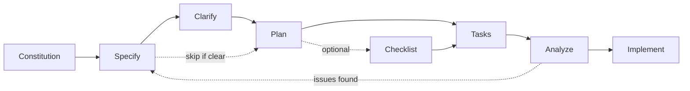

# How To: Set Up a New Project with Snow Patrol

A step-by-step guide for going from a blank canvas to a running application using Snow Patrol's agent architecture, prompts, and quality gates.

## Prerequisites

Before starting, install Snow Patrol into your target project:

```bash
./install.sh <target-directory>
```

Examples:

```bash
./install.sh .                    # install into current directory
./install.sh ~/Apps/my-project    # install into a specific project
```

### Platform selection

After running the install command, the script presents a platform selection menu:

```text
Select platform to install:

    1) GitHub Copilot
    2) Claude Code
    3) Snowflake Cortex Code
    4) Cursor
    5) OpenAI Codex
    6) Snowflake SnowWork
    7) All

Enter choice [1-7]:
```

| Choice | Platform              | Best for                                 | Installs to                                                                                          |
| ------ | --------------------- | ---------------------------------------- | ---------------------------------------------------------------------------------------------------- |
| 1      | GitHub Copilot        | VS Code with GitHub Copilot Chat         | `.github/`, `.claude/`, `.vscode/`, `docs/`                                                          |
| 2      | Claude Code           | Claude Code CLI or Claude-native editors | `CLAUDE.md`, `.claude/` (agents, commands, hooks, settings.json, skills), `docs/`                    |
| 3      | Snowflake Cortex Code | Snowflake Cortex Code environments       | `AGENTS.md`, `.cortex/` (agents, commands, hooks, instructions, settings.json, skills), `docs/`      |
| 4      | Cursor                | Cursor IDE with project rules            | `.cursor/` (rules, skills, mcp), `docs/`                                                             |
| 5      | OpenAI Codex          | Codex CLI and Codex-backed IDE workflows | `AGENTS.md`, `.codex/` (agents, hooks, hooks.json, instructions, prompts), `.agents/skills`, `docs/` |
| 6      | Snowflake SnowWork    | Snowflake workflow with AGENTS + Cortex  | `AGENTS.md`, `.cortex/`, `.vscode/`                                                                  |
| 7      | All                   | Mixed-client repos                       | All six platform layouts in one project                                                              |

Choose based on which AI coding assistant you use in your IDE, or choose `All` if the repo needs to work across every supported client. The script handles all path transformations automatically — the same agent definitions, skills, instructions, prompts, and hooks are adapted to each platform's expected directory structure. Claude installs include a root `CLAUDE.md` plus `.claude/hooks/` and `.claude/settings.json`, Cortex installs include a root `AGENTS.md` plus `.cortex/instructions/`, `.cortex/hooks/`, and `.cortex/settings.json`, Cursor installs include `.cursor/rules/`, `.cursor/hooks/`, and `.cursor/mcp.json`, Codex installs include a root `AGENTS.md` plus `.codex/hooks/` and `.codex/hooks.json`, and SnowWork installs combine `AGENTS.md`, `.cortex/`, and `.vscode/`.

For SnowWork and Snowflake Cortex Code, the installed `.cortex/agents/*.agent.md` files are role-definition prompts, not guaranteed native Task `subagent_type` values. Treat them as role specs that Powder loads into supported Task types such as `Explore`, `Plan`, and `general-purpose`.

If you install for Cursor, continue with [docs/cursor.md](cursor.md) for project-rule behavior, workflow entry points, and MCP setup.

If you install for Codex, continue with [docs/openai-codex.md](openai-codex.md) for trust, role usage, and repo-skill behavior.

### What gets installed

| Source                            | Contents                                                                                                                                                                                            |
| --------------------------------- | --------------------------------------------------------------------------------------------------------------------------------------------------------------------------------------------------- |
| `.github/agents/`                 | Agent definitions (conductor.powder, engineering.implementation, frontend.implementation, etc.). In Cortex-family installs these become role-definition prompts for built-in Task types.            |
| `.github/instructions/`           | Coding standard files (TypeScript, React, a11y, etc.)                                                                                                                                               |
| `.github/prompts/`                | Prompt templates (`/ship-application`, `/build-form`, etc.)                                                                                                                                         |
| `.github/skills/`                 | Domain knowledge skills (design-system, animation, Figma, etc.)                                                                                                                                     |
| `.github/copilot.instructions.md` | Master instruction index                                                                                                                                                                            |
| `.cortex/instructions/`           | Cortex instruction library copied from `.github/instructions/`; auto-applied in SnowWork and loaded on demand in Cortex CLI via `@.cortex/instructions/...` references inside generated agent files |
| `.cortex/commands/`               | Cortex command library built from `.prompt.md` slash-command templates                                                                                                                              |
| `.cortex/hooks/`                  | Cortex-native hook scripts copied from `.github/hooks/`                                                                                                                                             |
| `.cortex/settings.json`           | Cortex hook settings generated from `.github/hooks/hooks.json`                                                                                                                                      |
| `CLAUDE.md`                       | Claude Code project instructions file                                                                                                                                                               |
| `.claude/hooks/`                  | Claude-native hook scripts copied from `.github/hooks/`                                                                                                                                             |
| `.claude/settings.json`           | Claude hook settings generated from `.github/hooks/hooks.json`                                                                                                                                      |
| `.cursor/rules/`                  | Cursor project rules derived from agents, instructions, prompts, and skills                                                                                                                         |
| `.cursor/skills/`                 | Cursor skill library and reference material                                                                                                                                                         |
| `.cursor/mcp.json`                | Cursor MCP server configuration                                                                                                                                                                     |
| `.claude/commands/`               | SpecKit slash commands (for Claude)                                                                                                                                                                 |
| `AGENTS.md`                       | AGENTS-compatible project instructions file for Codex, SnowWork, and Cortex CLI installs                                                                                                            |
| `.codex/agents/`                  | Codex-native agent role files                                                                                                                                                                       |
| `.codex/hooks/`                   | Codex-native hook scripts copied from `.github/hooks/`                                                                                                                                              |
| `.codex/hooks.json`               | Codex hook settings generated from `.github/hooks/hooks.json`                                                                                                                                       |
| `.codex/instructions/`            | Reference instruction library for Codex workflows                                                                                                                                                   |
| `.codex/prompts/`                 | Reference prompt library for Codex workflows                                                                                                                                                        |
| `.agents/skills/`                 | Codex-visible skill library                                                                                                                                                                         |
| `.vscode/mcp.json`                | MCP server configuration for Copilot and SnowWork                                                                                                                                                   |
| `.vscode/settings.json`           | VS Code / Copilot / SnowWork settings                                                                                                                                                               |
| `.github/hooks/`                  | Copilot Hooks — deterministic enforcement of safety rules via shell scripts                                                                                                                         |
| `docs/`                           | How-to guides                                                                                                                                                                                       |
| `.snow-patrol-manifest.json`      | Framework manifest — machine-readable list of all protected files                                                                                                                                   |

Existing files in the target are overwritten. Back up first if needed.

> **⚠️ Safe Scaffolding Warning**: When scaffolding your application, NEVER run scaffolding commands at the project root (`npx create-react-app .`, etc.) — these will overwrite the `.github/` and `.vscode/` directories containing the Snow Patrol framework. Instead, scaffold into a subdirectory (`npx create-react-app ./app`) or create config files individually. See `.github/instructions/protected-framework-files.instructions.md` for full details.

### Native Hooks

Snow Patrol's canonical hook source lives under `.github/hooks/`. Platform installs that support native hooks copy that tree into the platform-native location and generate the matching config file.

- **GitHub Copilot** uses `.github/hooks/` directly.
- **Snowflake Cortex Code** and **SnowWork** use `.cortex/hooks/` plus `.cortex/settings.json`.
- **Cursor** uses `.cursor/hooks/` plus `.cursor/hooks.json`.
- **Claude Code** uses `.claude/hooks/` plus `.claude/settings.json`.
- **OpenAI Codex** uses `.codex/hooks/` plus `.codex/hooks.json`.

Prompt-submit hooks now do two separate jobs: a routing hook injects conductor-first guidance for broad requests, and a capture hook writes the raw prompt to disk for scope verification. The routing hook is advisory in this rollout. If the user explicitly names a specialist agent or a built-in task type, the routing hook preserves that opt-out instead of forcing conductor.powder.

Subagent lifecycle hooks are secondary. Snow Patrol's primary routing mechanism is the prompt-submit layer, not subagent-start or subagent-stop events.

Today those lifecycle hooks are natively mapped for Claude and the Cortex-family installs only. Cursor and Codex still use prompt-submit routing plus the supported session/tool hook surface.

Installed hooks include guards for protected file safety, heredoc prevention, git workflow conventions, conductor-first routing, and a full audit trail of every tool invocation.

For full details on each hook, configuration, and customization, see [docs/available-hooks.md](available-hooks.md).

### Optional: Initialize SpecKit

If you want specification-driven development with structured specs, plans, and tasks:

```bash
specify init . --ai claude <<< "y"
```

SpecKit artifacts (`specs/*/spec.md`, `plan.md`, `tasks.md`) integrate directly with conductor.powder's orchestration — she uses them as her source of truth when they exist.

### Initialize Project Context

Create the project wake-up file so AI agents can quickly orient themselves:

1. **Create `.github/PROJECT_CONTEXT.md`** (~50 lines) with: project identity, tech stack, architecture summary, current state, what's next, and key decisions. This file is loaded automatically by `context-loader.sh` at session start.

2. **Populate `.specify/memory/constitution.md`** — replace template placeholders with your actual project principles, technical standards, development workflow, and governance model.

3. **Seed repository memory** — use the VS Code memory tool to create entries in `/memories/repo/`:
   - `project-state.md` — Identity, architecture summary, key conventions
   - `conventions.md` — Commit format, branch naming, code style, testing approach
   - `architecture.md` — Conductor-subagent pattern, hooks, SpecKit pipeline
   - `decisions-log.md` — Key technology and architectural decisions
   - `active-work.md` — Current branch, spec directory, phase progress

These files persist across sessions and reduce context re-discovery overhead.

---

## The Workflow

1. **Step 1:** [Discovery — Validate the idea before building](#step-1-discovery--validate-the-idea)
2. **Step 2:** [Architecture — Design the technical foundation](#step-2-architecture--plan-before-you-build)
3. **Step 2B:** [Constitution — Build the project DNA](#step-2b-constitution--build-the-project-dna)
4. **Step 3:** [Scaffold — Generate the project skeleton](#step-3-scaffold--stand-up-the-skeleton)
5. **Step 4:** [Backend — Configure Firebase services](#step-4-backend--configure-firebase)
6. **Step 5:** [Design Foundation — Visual identity, theme, marketing page, app shell](#step-5-design-foundation--set-the-visual-tone)
7. **Step 6:** [Authentication — Identity and access control _(optional)_](#step-6-authentication--identity--access-optional)
8. **Step 6B:** [Plan Features — Spec-driven pipeline](#step-6b-plan-features--spec-driven-pipeline)
9. **Step 7:** [Features — Build iteratively through the full pipeline](#step-7-features--build-iteratively)
10. **Step 8:** [Billing — Stripe payments (if SaaS)](#step-8-billing--payments--subscriptions-if-saas)
11. **Step 9:** [Polish — Quality sweep across the whole app](#step-9-polish--full-quality-pass)
12. **Step 10:** [Browser Agent Testing — Verify the live UI in an automated browser](#step-10-browser-agent-testing--verify-the-live-ui)
13. **Step 10B:** [Compliance Audit — Verify all phases passed required gates](#step-10b-compliance-audit--verify-all-phases)
14. **Step 11:** [Pre-Launch — Legal, CI/CD, production config _(optional)_](#step-11-pre-launch--legal-cicd-production)
15. **Step 12:** [Launch — Deploy and monitor _(optional)_](#step-12-launch--ship-it)

Each step has a **gate** — you should not proceed until the gate condition is met. conductor.powder enforces these gates when she orchestrates, but you should be aware of them when running prompts manually.

---

## Step 1: Discovery — Validate the Idea

**Goal**: Answer "Is this worth building?" before writing any code.

### What to do

Open Copilot Chat and run:

```text
/critical-thinking-review [describe your product idea]
```

Then run:

```text
/value-realization-analysis [describe your product idea]
```

### What happens

- **Critical Thinking agent** challenges every assumption — market, technical feasibility, scope, and differentiation
- **Value Realization skill** analyzes whether users will discover clear value, what the "aha moment" is, and where adoption will break down

### User Research Tools

For deeper discovery, use these additional agents, skills, and prompts:

- **design.ux-engineer agent** — enforces CRUD completeness, UX/UI consistency, and flow standards
- **ux-researcher-designer skill** — data-driven persona generation, journey mapping, usability testing frameworks, and research synthesis
- **value-realization skill** — analyzes whether end users will discover clear value in product ideas

**Prompts for deeper research:**

```text
/ux-research-personas [describe your target users]
/value-realization-analysis [describe your product idea]
```

These tools help you build a complete picture of who your users are, what they need, and whether your idea will resonate — before a single line of code is written.

### Gate

You can articulate in one sentence: what the product does, who it's for, and why they'd pay for it (or use it). If you can't, iterate here until you can.

### What you'll have after this step

- A validated product concept with assumptions tested
- Clear value proposition and target user
- Known risks and open questions documented

---

## Step 2: Architecture — Plan Before You Build

**Goal**: Make Day 0 decisions about stack, structure, data model, and security before any code exists.

### What to do

```text
/architect-new-project [describe what you're building]
```

This invokes conductor.powder, who orchestrates:

| Agent                   | Role                                         |
| ----------------------- | -------------------------------------------- |
| Critical Thinking       | Challenge stack and architecture assumptions |
| `architecture.engineer` | Produce the 9-section architecture document  |
| frontend.design-system  | Design system strategy and token plan        |
| security.application    | Security architecture review                 |

### What this produces

1. **Architecture Decision Document** — Stack choices with rationale
2. **Frontend Architecture Plan** — Components, routing, state management, styling
3. **Backend Architecture Plan** — Data model, API surface, security model
4. **Design System Baseline** — Token palette, typography, component library plan
5. **Security Architecture** — Auth model, authorization, data isolation, threat model
6. **Project Structure Map** — Directory layout, package boundaries

### Gate

Architecture document reviewed and approved. All open questions resolved. You understand how the pieces fit together before generating any files.

### What you'll have after this step

- Complete architecture documentation
- Agreed-upon tech stack and patterns
- Security model designed
- Project structure planned

---

## Step 2B: Constitution — Build the Project DNA

**Goal**: Establish non-negotiable rules for code consistency, quality, and architectural integrity before any implementation begins.

### Why this matters

The **Project Constitution** is your project's DNA — it dictates strict behavioral and technical rules that every agent follows. Without it, different agents may make conflicting decisions, leading to inconsistent code and architecture drift. The constitution must be established before moving to any implementation steps.

### What to do

```text
/speckit.constitution
```

Or invoke the agent directly:

```text
@speckit.constitution
```

### What this produces

A `constitution.md` file in `.specify/memory/` containing:

- **Core Principles** — 5+ project-specific rules that govern all development decisions
- **Technical Standards** — Patterns, naming conventions, error handling strategies
- **Quality Gates** — What must pass before code ships (test coverage, lint rules, review requirements)
- **Governance Rules** — How the constitution evolves as the project matures

### How it's used

Every SpecKit agent (`speckit.plan`, `speckit.tasks`, `speckit.analyze`, `speckit.implement`) reads the constitution as **non-negotiable authority**. It ensures consistency across the entire project regardless of which agent does the work.

### Gate

Constitution reviewed and approved by you. All placeholder tokens filled with project-specific values. Every team member (human or agent) understands the rules.

### What you'll have after this step

- A living `constitution.md` that governs all downstream work
- Clear, enforceable standards for code quality and architecture
- A shared contract between all agents and contributors

---

## Step 3: Scaffold — Stand Up the Skeleton

**Goal**: Generate the monorepo structure, install dependencies, and get a project that builds and runs (empty shell).

### What to do

```text
/scaffold-new-app [app name and whether it needs multi-tenant support]
```

This invokes `architecture.engineer` to scaffold the project using Snow Patrol's standard stack:

| Component       | Technology                                                            |
| --------------- | --------------------------------------------------------------------- |
| Frontend        | React 18+, Vite, TypeScript strict                                    |
| Styling         | Tailwind CSS v4 (`@tailwindcss/vite` plugin, no `tailwind.config.js`) |
| Components      | shadcn/ui + Radix                                                     |
| State           | Zustand + TanStack Query                                              |
| Backend         | Firebase (Auth, Firestore, Cloud Functions, Hosting)                  |
| Package Manager | pnpm workspaces (monorepo)                                            |
| Validation      | Zod                                                                   |
| Testing         | Vitest                                                                |
| Icons           | Lucide React                                                          |

### What this produces

```text
your-app/
├── apps/
│   └── web/              # React frontend (Vite)
├── packages/
│   ├── shared/           # Shared types, schemas, utilities
│   └── firebase/         # Firestore rules, Cloud Functions
├── pnpm-workspace.yaml
├── package.json
├── tsconfig.json
└── ...
```

### Gate

The project builds (`pnpm build`) and runs (`pnpm dev`) with no errors. The dev server starts and shows an empty page.

### What you'll have after this step

- A working monorepo that builds and runs
- TypeScript strict mode configured
- Tailwind v4 with Vite plugin configured
- Vitest ready for tests
- Architecture docs generated alongside the scaffold

---

## Step 4: Backend — Configure Firebase

**Goal**: Set up the backend foundation so features have somewhere to store data and authenticate users.

### What to do

```text
/scaffold-firebase-setup
```

This configures:

- `firebase.json` and `.firebaserc` project config
- Firestore security rules skeleton with tenant isolation patterns
- Cloud Functions directory with TypeScript
- Firebase Hosting with SPA rewrites
- Firebase emulator configuration for local development
- Auth context/provider for React

### Gate

Firebase emulators start successfully (`firebase emulators:start`). You can see the Firestore and Auth emulator UIs.

### What you'll have after this step

- Firebase project configured for local development
- Firestore security rules with default-deny
- Cloud Functions scaffold
- Emulator config for offline development
- Auth provider wired into React

---

## Step 5: Design Foundation — Set the Visual Tone

**Goal**: Establish how the product looks and feels before building any features. This is the most commonly skipped step and the most commonly regretted.

### Why this matters

Every great product has a visual personality that users feel before they think. Skipping this step leads to:

- Inconsistent UI that gets reworked repeatedly
- Features that look like different apps stitched together
- No marketing presence (users can't discover the product)
- Design debt that compounds with every feature

### What to do

```text
/design-foundation [product description and any brand/visual direction]
```

This is a major step with multiple substeps. conductor.powder orchestrates:

| Agent                                                                                                     | Role                                                                  |
| --------------------------------------------------------------------------------------------------------- | --------------------------------------------------------------------- |
| frontend.design-system (with design-system + elegant-design skills)                                       | Token audit, component inventory, theme plan                          |
| design.visual-designer (with product-designer + design-system + elegant-design + frontend-design skills)  | Decompose design mocks into pixel-precise visual implementation specs |
| frontend.implementation (with design-system + product-designer + elegant-design + frontend-design skills) | Build visual foundation                                               |
| design.ux-engineer (with product-designer + elegant-design + frontend-design skills)                      | Validate layout, navigation, flow                                     |
| frontend.accessibility                                                                                    | Accessibility audit of foundation UI                                  |

### Substeps

**5A: Visual Identity & Theme**

- Brand colors (primary, neutral scale, semantic colors)
- Typography (font family, type scale, weights)
- Spacing, border radii, shadows
- Dark mode support from Day 1
- CSS custom properties in `theme.css`

**5B: Marketing / Landing Page** (always required, no exceptions)

Every product needs a front door:

- Hero with value proposition and primary CTA
- Feature highlights, social proof, how-it-works sections
- Responsive, accessible, SEO-ready
- Footer with legal link placeholders

**5C: App Shell** (authenticated layout skeleton)

- Sidebar or top navigation (themed, responsive, collapsible)
- Top bar with breadcrumbs and user menu
- Main content area with proper HTML landmarks
- Empty states and loading skeletons
- For nav-driven products: define a Main Navigation Coverage Matrix so every primary destination has a distinct purpose and planned screen, not a generic repeated dashboard shell

**5D: Screen Mocks** (prove the visual language)

Mock 2-4 representative screens before building real features:

- Dashboard/home view
- List/table view
- Detail/form view
- Settings view

If the product relies on primary navigation with multiple destinations, expand this into one approved mock or explicit approved defer/block decision per primary nav destination.

### Design system defaults

| Element     | Default                                 | Notes                                        |
| ----------- | --------------------------------------- | -------------------------------------------- |
| Aesthetic   | "Clean authority"                       | Premium SaaS — Linear meets Notion           |
| Brand color | `#5900FF`                               | Used sparingly on CTAs, active states, links |
| Font        | DM Sans                                 | `sans-serif` fallback                        |
| Components  | shadcn/ui + Radix                       | Themed with brand tokens, not default        |
| Icons       | Lucide React                            | `currentColor` fills, consistent sizing      |
| Radii       | 10px                                    | Modern but not bubbly                        |
| Shadows     | `shadow-sm` cards, `shadow-md` popovers | Flat with depth hints                        |

### Gate

User approves the visual direction — the marketing page, app shell, and mock screens look and feel right. Only then proceed to features. The frontend.accessibility accessibility audit must PASS (contrast, landmarks, keyboard nav, reflow at 320px).

Additional gate requirements:

- Figma component library and baseline screen frames created via @frontend.design-system
- Storybook initialized with baseline component stories via @frontend.storybook
- Mobile responsiveness verified at 320px and 768px
- For nav-driven products, every primary nav destination is accounted for in the Main Navigation Coverage Matrix and is either mocked, explicitly approved as deferred, or blocked with rationale

### What you'll have after this step

- Themed design system with CSS custom properties
- Configured shadcn/ui components matching the brand
- Figma component library with design tokens, baseline components, and baseline screen frames
- Storybook with baseline component stories
- A live marketing/landing page
- An authenticated app shell skeleton
- Mock screens proving the visual language
- Mobile responsiveness verified at 320px and 768px breakpoints
- Accessibility audit PASS

---

## Step 6: Authentication — Identity & Access (Optional)

> **Optional:** Skip this step if your project doesn't require user authentication or identity management. Not all projects need auth — static sites, internal tools with network-level auth, or public data apps may skip directly to Step 6B or Step 7.

**Goal**: Wire up auth flows using the themed UI from Step 5.

### What to do

```text
/build-auth-flow [providers needed and whether multi-tenant]
```

For multi-tenant apps, also run:

```text
/build-multi-tenant
```

This produces:

- Firebase Auth with email/password + Google OAuth
- Custom claims (`tenantId`, `role`, `permissions`)
- RBAC roles: owner, admin, editor, viewer
- Login, signup, forgot password pages matching the design foundation
- Protected routes and tenant-scoped data access
- Onboarding flow: new user → create tenant → set claims → redirect to dashboard

### Gate

- Auth flow works end-to-end (signup, login, logout, password reset)
- security.application security audit PASS (mandatory for all auth work)
- Roles and permissions enforced in both Firestore rules and Cloud Functions

### What you'll have after this step

- Working authentication with themed UI
- Role-based access control
- Security audit PASS
- Protected routes

---

## Step 6B: Plan Features — Spec-Driven Pipeline

**Goal**: Plan every feature through the SpecKit pipeline before implementation begins. Features are ALWAYS specified, clarified, planned, tasked, and analyzed before a single line of code is written.

### Why this matters

Jumping straight to code leads to rework, scope creep, and inconsistent quality. The SpecKit pipeline ensures every feature is fully thought through — from user stories to technical plan to ordered tasks — before implementation starts. The constitution (Step 2B) feeds into every stage as non-negotiable authority.

### The SpecKit Pipeline



#### 1. Specify

These manual `/speckit.*` commands still exist, but they now route through `conductor.powder`, which delegates to the appropriate SpecKit stage and preserves `plans/powder-active-task-plan.md` across the loop.

```text
/speckit.specify [describe the feature]
```

- Creates a structured feature specification from a natural language description
- Generates branch name, user stories, acceptance criteria, priorities (P1/P2/P3)
- **Agent route:** `conductor.powder -> speckit.specify` — auto-creates a `spec.md` in the feature's specs directory
- **Handoffs to:** Clarify or Plan

#### 2. Clarify

```text
/speckit.clarify
```

- Identifies underspecified areas in the spec
- Asks up to 5 highly targeted clarification questions
- Scans for functional scope gaps, domain model ambiguity, edge cases, integration points
- Marks each area as **Clear** / **Partial** / **Missing**
- Encodes answers back into the spec
- **Agent route:** `conductor.powder -> speckit.clarify`
- **Handoffs to:** Plan

#### 3. Tech Plan

```text
/speckit.plan
```

- Generates the technical implementation plan from spec + constitution
- Produces design artifacts: `research.md`, `data-model.md`, `contracts/`, `quickstart.md`
- Checks constitution compliance at every decision point
- **Agent route:** `conductor.powder -> speckit.plan`
- **Handoffs to:** Tasks or Checklist

#### 4. Tasks

```text
/speckit.tasks
```

- Generates an actionable, dependency-ordered `tasks.md`
- Tasks organized by user story with dependency graph
- Marks parallelizable tasks with `[P]` for concurrent execution
- **Agent route:** `conductor.powder -> speckit.tasks`
- **Handoffs to:** Analyze or Implement

#### 5. Analyze (Consistency Check)

```text
/speckit.analyze
```

- **STRICTLY READ-ONLY** — does not modify any files
- Cross-references spec, plan, and tasks for inconsistencies
- Checks for duplications, ambiguities, missing coverage
- Constitution is the non-negotiable authority
- Produces a structured analysis report — review it before proceeding
- **Agent route:** `conductor.powder -> speckit.analyze`
- **No auto-handoff** — you must manually invoke `/speckit.implement` after reviewing the analysis

#### 6. Implement

```text
/speckit.implement
```

- Executes all tasks from `tasks.md` in dependency order
- Checks checklists status first (stops if incomplete)
- Follows the plan's architecture decisions and constitution constraints
- **Agent route:** `conductor.powder -> speckit.implement`

### How handoffs work

Each SpecKit agent can automatically hand off to the next step in the pipeline, creating a smooth flow from idea to implementation. When one step completes, you'll see a handoff button suggesting the next step. You can review the output and proceed when ready — the pipeline never auto-advances without your approval.

### When to use the full pipeline

- **Always** for new features with any complexity
- **Always** when the feature touches multiple files or systems
- **Shortened** (Specify → Plan → Implement) for trivial changes where the spec is already clear

> **Note:** If the Analyze step finds issues, **loop back** to the relevant earlier step to fix them before running `/speckit.implement`. This catch-before-you-build approach prevents costly rework.

### Gate

Feature specification complete. Tech plan reviewed. Tasks generated and dependency-ordered. Analysis report shows no unresolved issues. Constitution compliance verified.

### What you'll have after this step

- A complete `spec.md` with user stories and acceptance criteria
- A technical plan with architecture decisions documented
- An ordered `tasks.md` ready for implementation
- An analysis report confirming consistency across all artifacts

---

## Step 7: Features — Build Iteratively

**Goal**: Build features one at a time through the full agent pipeline. Each feature goes through design audit → implementation → code review → quality gates.

### What to do

For each feature, run:

```text
/build-full-stack-feature [describe the feature]
```

Or for idea-stage features:

```text
/feature-from-idea [describe the idea]
```

### The pipeline for each feature

```text
frontend.design-system ──── Component reuse plan (what exists vs. what's new)
    │
design.visual-designer ────── Mock-to-spec decomposition, design fidelity specs
    │
design.ux-engineer ─ CRUD completeness, flow validation
    │
engineering.implementation + frontend.implementation ── Backend + frontend implementation (parallel)
    │
quality.code-review ─── Code review (APPROVED required)
    │
security.application + frontend.accessibility ── Security + accessibility gates (parallel, both PASS required)
    │
Commit ─────── conductor.powder presents summary, you make the git commit
```

### Specialized feature prompts

Use these instead of the generic feature prompt when building specific UI patterns:

| Feature Type                 | Prompt                    |
| ---------------------------- | ------------------------- |
| Forms                        | `/build-form`             |
| Data tables                  | `/build-data-table`       |
| Dashboards                   | `/build-dashboard`        |
| Wizards / multi-step flows   | `/build-wizard`           |
| Search interfaces            | `/build-search`           |
| Real-time features           | `/build-realtime-feature` |
| File uploads                 | `/build-file-upload`      |
| Notification systems         | `/build-notifications`    |
| Navigation / routing         | `/build-navigation`       |
| Animations / transitions     | `/add-animations`         |
| State management patterns    | `/setup-state-management` |
| Third-party API integrations | `/api-integration`        |
| Onboarding flows             | `/build-onboarding`       |
| Email systems                | `/build-email-system`     |
| Pages / views                | `/build-page`             |
| UI components                | `/build-ui-component`     |

### Gate

Every feature must pass: code review (APPROVED) + security audit (PASS, if applicable) + accessibility audit (PASS) before starting the next feature.

### Powder execution modes

Powder supports two execution modes for feature work:

- `normal` — the default. Powder pauses for plan approval, phase handoffs, and soft workflow blockers.
- `--auto` — continue automatically through soft workflow gates while still running them and recording findings.

`--auto` does NOT bypass hard safety hooks. Protected files, no-heredoc, git safety, and conductor delegation rules still block unsafe operations.
`--auto` also does NOT permit skipping mandatory workflow agents or deliverables. If a step requires frontend.design-system, frontend.storybook, security, accessibility, or browser verification, Powder must still run them.

In `--auto`, findings from review, security, accessibility, browser testing, Storybook, or docs become automatic follow-up work for the next iteration instead of a hard pause for human approval.

### What you'll have after this step

- All core features implemented with tests
- Code reviewed and quality-gated
- Consistent UI following the design foundation

---

## Step 8: Billing — Payments & Subscriptions (If SaaS)

**Goal**: Add Stripe billing for subscriptions, trials, and payment management.

### What to do

```text
/setup-stripe-billing [pricing model, trial length, B2C vs B2B]
```

conductor.powder coordinates:

| Agent                   | Role                                                           |
| ----------------------- | -------------------------------------------------------------- |
| billing.stripe          | Stripe architecture — products, prices, webhooks, entitlements |
| security.application    | Security review of billing Functions and webhook handlers      |
| platform.pce            | Payment/subscription clauses for legal docs                    |
| frontend.implementation | Checkout UI, billing portal, plan selection                    |

### Gate

Stripe test mode working end-to-end. security.application security audit PASS on billing Functions.

---

## Step 9: Polish — Full Quality Pass

**Goal**: Sweep the entire application for quality issues before launch.

### What to do

Run these audits across the full codebase:

```text
/accessibility-audit
/security-audit
/code-review
/performance-optimization
```

### What gets checked

- **frontend.accessibility** — Complete WCAG 2.2 AA accessibility audit
- **security.application** — Full security audit (Firestore rules, Functions, auth, storage)
- **quality.code-review** — Codebase-wide code review
- **Performance** — Lighthouse scores, bundle analysis, lazy loading, image optimization
- **Testing** — Coverage gaps, edge cases, error handling

### Gate

All audits PASS. No CRITICAL or HIGH findings unresolved.

---

## Step 10: Browser Agent Testing — Verify the Live UI

**Goal**: Use VS Code's browser agent tools to autonomously test the running application in a real browser — validating forms, layouts, flows, accessibility, and interactive behavior end-to-end. When the next step is to take the real running app into Figma, this phase also produces the browser-verified capture handoff package.

### Why this matters

Static code analysis and unit tests catch logic errors, but they can't see what a real user sees. Browser agent testing opens the application in VS Code's integrated browser, interacts with it like a user would, takes screenshots, reads page content, and reports what's broken — all without manual intervention.

For live app to Figma workflows, this is the fail-closed evidence phase. The browser run establishes the canonical route/state inventory, confirms which destinations are genuinely reachable and non-placeholder, and produces the screenshots that feed `generate_figma_design`. If localhost is unavailable or required routes cannot be exercised, stop and report BLOCKED instead of guessing.

### Prerequisites

- VS Code with GitHub Copilot
- Browser agent tools enabled: set `workbench.browser.enableChatTools` to `true` in VS Code settings
- Your application running locally (`pnpm dev` or equivalent)
- If this run will feed Figma capture, the relevant routes and states must be reachable in the browser

### What to do

1. Start the development server so the app is running on `localhost`
2. Open Copilot Chat and use one of these approaches:
   - **Agent**: Select `@frontend.browsertesting` from the Agent dropdown and describe what to test
   - **Prompt**: Use the `/browser-agent-testing` prompt template with `@conductor.powder` for orchestrated testing
   - **Manual**: Select any agent, enable Browser tools, and prompt directly with the scenarios below
3. Select the **Tools** button in the chat input area and verify all **Browser** tools are enabled
4. If this run will feed a Figma capture workflow, tell the agent to produce a canonical route/state inventory with screenshots and mark each destination/state as `capture-ready`, `blocked`, or `placeholder`
5. Run the scenarios below

### Testing scenarios

Work through each scenario by prompting the agent in Copilot Chat. The agent uses `openBrowserPage`, `navigatePage`, `readPage`, `screenshotPage`, `clickElement`, `typeInPage`, and other browser tools to interact with the running application.

#### Form validation testing

```text
Open http://localhost:5173/contact (or the relevant form page). Test the form by:
- Submitting with empty required fields and verifying error messages appear
- Entering invalid data (e.g., malformed email) and verifying validation rules
- Filling all fields correctly and verifying successful submission
```

#### Responsive layout verification

```text
Open http://localhost:5173 and take screenshots at these viewport widths: 320px, 768px, 1024px, 1440px.
For each size, verify:
- Navigation menus collapse/expand correctly
- Content reflows without horizontal scrolling
- No elements overflow or overlap
- Text remains readable
```

#### Authentication flow testing

```text
Open http://localhost:5173/login and test the authentication flow:
- Try logging in with empty credentials and verify error handling
- Enter an invalid email format and verify client-side validation
- Enter valid credentials and verify successful redirect to the dashboard
- Verify the logout flow returns to the login page
```

#### Interactive functionality testing

```text
Open http://localhost:5173/dashboard (or the main app view) and test interactive elements:
- Click through navigation items and verify routing works
- Confirm every primary nav destination is reachable, non-placeholder, and materially distinct from the others
- Open and close modals, dropdowns, and popovers
- Verify state updates when interacting with controls (toggles, selects, tabs)
- Test any drag-and-drop or gesture-based interactions
```

#### Main navigation coverage testing

````text
Open the running app shell and audit the main navigation:
- Inventory every primary nav item in the sidebar/top navigation
- Click each one and verify it opens the intended destination
- Confirm each destination has unique purpose/content and is not a generic duplicate
- Report any placeholder, blank, or repeated screens as failures
- For running-app-to-Figma workflows, capture one screenshot per reachable destination/state and mark each as `capture-ready`, `blocked`, or `placeholder`

#### Running app to Figma capture handoff

```text
Open the running application and treat browser testing as the capture evidence phase:
- Build the canonical route/state inventory for every destination that must appear in Figma
- Confirm each destination/state is reachable and materially distinct
- Capture a screenshot for each reachable destination/state
- Return the recommended capture order for `generate_figma_design`
- If localhost is down, a required route cannot be exercised, or the app is too incomplete to verify, return BLOCKED instead of inventing screens
````

````

#### Accessibility audit

```text
Open http://localhost:5173 and perform an accessibility audit:
- Check all images for meaningful alt text (or empty alt for decorative images)
- Verify heading hierarchy (h1 → h2 → h3, no skipped levels)
- Test keyboard navigation through all interactive elements (Tab, Shift+Tab, Enter, Escape)
- Check color contrast meets WCAG 2.2 AA (4.5:1 for text, 3:1 for large text)
- Verify focus indicators are visible on all interactive elements
````

#### End-to-end user journey

```text
Open http://localhost:5173 and walk through a complete user journey:
- Start at the marketing/landing page
- Navigate to sign up or log in
- Complete onboarding (if applicable)
- Perform the primary user action (create, edit, view core content)
- Verify the experience is smooth with no dead ends or broken states
```

### How it works under the hood

The browser agent uses these VS Code integrated browser tools:

| Tool                | Purpose                                           |
| ------------------- | ------------------------------------------------- |
| `openBrowserPage`   | Open a URL in the integrated browser              |
| `navigatePage`      | Navigate to a different URL                       |
| `readPage`          | Read the page content and structure               |
| `screenshotPage`    | Capture a screenshot at the current viewport size |
| `clickElement`      | Click buttons, links, and interactive elements    |
| `hoverElement`      | Hover over elements to trigger tooltips/menus     |
| `typeInPage`        | Type text into input fields                       |
| `handleDialog`      | Interact with browser dialogs (alert, confirm)    |
| `runPlaywrightCode` | Run custom Playwright automation scripts          |

Pages opened by the agent run in private, in-memory sessions that don't share cookies or storage with your other browser tabs.

### Gate

All testing scenarios relevant to the application pass. Form validation works correctly. Responsive layouts verified at key breakpoints. Authentication flows complete without errors. Accessibility audit shows no critical issues. Any bugs found by the agent are fixed and re-verified.

If this step feeds a running-app-to-Figma workflow, the result must also include a Capture Handoff Package with canonical route/state inventory, screenshots, reachable/non-placeholder confirmation, and capture order suitable for `generate_figma_design`. If localhost is unavailable, required routes are unreachable, or browser tools are not available, the workflow is BLOCKED.

### What you'll have after this step

- Live UI verified by automated browser interaction
- Responsive behavior confirmed across breakpoints
- Form validation and error handling tested end-to-end
- Authentication flows (if applicable) verified
- Accessibility audit from real page rendering
- For running-app-to-Figma work, a Capture Handoff Package that frontend.design-system can use for `generate_figma_design`
- Confidence that what users see matches what you built

> **Note**: Browser agent tools are currently experimental in VS Code. For full documentation, see the [VS Code Browser Agent Testing Guide](https://code.visualstudio.com/docs/copilot/guides/browser-agent-testing-guide).

---

## Step 10B: Compliance Audit — Verify All Phases

**Goal**: Independent verification that every phase in the plan was executed properly by the required gates. Catches skipped gates before the plan is marked complete.

### When it runs

Powder invokes `compliance.phases-checker` automatically as Phase 3 (Compliance Audit) after all implementation phases finish and before writing the plan completion file. No user action needed.

### What it checks

For each phase completion file in the plan:

| Check                            | What it verifies                                                     |
| -------------------------------- | -------------------------------------------------------------------- |
| Phase Gate Receipt exists        | Every phase file contains a `## Phase Gate Receipt` section          |
| No contradictions                | No gate shows `NOT RUN` while `Phase valid: YES`                     |
| Evidence contains real artifacts | Storybook references `.stories.` files, Implementation has count > 0 |
| Artifact cross-reference         | Referenced files actually exist in the workspace                     |
| Phase valid assertion            | Every phase asserts `Phase valid: YES`                               |

### What gets produced

A **Compliance Audit Report** with:

- Per-phase PASS/FAIL results table
- Overall status: PASS / FAIL / ESCALATED
- If FAIL: specific missing or contradictory gates, real artifact paths that were expected

### Retry behavior

- **PASS**: Powder proceeds to write the plan completion file
- **FAIL**: Powder re-runs the failed phases (delegates to standard implementation/gate agents), then re-invokes compliance.phases-checker
- **3rd FAIL**: Status escalates to ESCALATED — Powder stops automation and presents the user with a full history of all 3 failure reasons and recommendations

### Gate

Compliance audit PASS (or ESCALATED with user acknowledgment). No plan completion file may be written while the compliance audit shows FAIL.

---

## Step 11: Pre-Launch — Legal, CI/CD, Production

**Goal**: Everything needed to go live.

### What to do

```text
/draft-legal-docs
/setup-cicd-deployment
/generate-docs
```

### What gets produced

| Deliverable       | Agent                      | Details                                                            |
| ----------------- | -------------------------- | ------------------------------------------------------------------ |
| Terms of Service  | platform.pce               | Plain-language, region-aware (GDPR/CPRA)                           |
| Privacy Policy    | platform.pce               | Matches actual data flows                                          |
| Cookie Policy     | platform.pce               | Matches actual tracking stack                                      |
| CI/CD Pipeline    | engineering.implementation | GitHub Actions: lint → test → build → deploy                       |
| Production Config | engineering.implementation | Environment variables, Firebase production project, error tracking |
| Documentation     | Various                    | README, API docs, deployment guide                                 |

### Gate

Legal docs published. CI/CD deploying to staging successfully. Smoke tests passing on staging.

---

## Step 12: Launch — Ship It

**Goal**: Deploy to production and verify everything works.

### What to do

1. Deploy to production via CI/CD
2. Run smoke tests on key user flows in production
3. Monitor error tracking for the first 24-48 hours
4. Gather initial user feedback
5. Plan the first iteration based on real usage

---

## Post-Launch: Ongoing Development

After launch, use these prompts for continued work:

| Need                | Prompt                      |
| ------------------- | --------------------------- |
| Fix bugs            | `/fix-bug`                  |
| New features        | `/build-full-stack-feature` |
| Address tech debt   | `/refactor-tech-debt`       |
| Update dependencies | `/dependency-maintenance`   |
| Check design drift  | `/audit-design-system`      |
| Add onboarding      | `/build-onboarding`         |
| Add email system    | `/build-email-system`       |
| Create a new agent  | `/new-agent`                |
| Challenge decisions | `/critical-thinking-review` |

---

## Quick Reference: The Master Prompt

The single entry point for the entire workflow:

```text
/ship-application [describe what you want to build]
```

conductor.powder walks through **every step** of the workflow above, in order — from Discovery through Launch. At each phase she invokes the right agents, enforces every gate, and pauses for your approval at each milestone before advancing.

**Optional steps are never silently skipped.** Steps marked _(optional)_ — such as Authentication (Step 6) or Billing (Step 8) — are still presented during the workflow. conductor.powder will ask whether you need them so you can make an explicit decision rather than discovering a gap later. This ensures nothing is missed, even when a step doesn't apply to every project.

---

## Tips

- **Don't skip Step 2B (Constitution)**. The constitution is your project's DNA. Every agent reads it as non-negotiable authority — skipping it means agents make inconsistent decisions.
- **Don't skip Step 5 (Design Foundation)**. It saves more time than it costs. Every feature you build afterward uses the visual language established here.
- **One feature at a time in Step 7**. Resist the urge to build multiple features in parallel. Each feature should pass all gates before starting the next.
- **Use the SpecKit pipeline (Step 6B) for every feature**. Don't skip specification and planning. Run `/speckit.specify` → `/speckit.clarify` → `/speckit.plan` → `/speckit.tasks` → `/speckit.analyze` → `/speckit.implement`. The constitution (Step 2B) ensures consistency across the entire project.
- **Let conductor.powder orchestrate**. The prompts work standalone, but conductor.powder coordinates agents, enforces gates, and manages the phase cycle. Use `@conductor.powder` in Copilot Chat to get the full orchestration benefit.
- **Read the gates**. Every gate exists because skipping it leads to rework. If a gate fails, fix the issues before proceeding.
